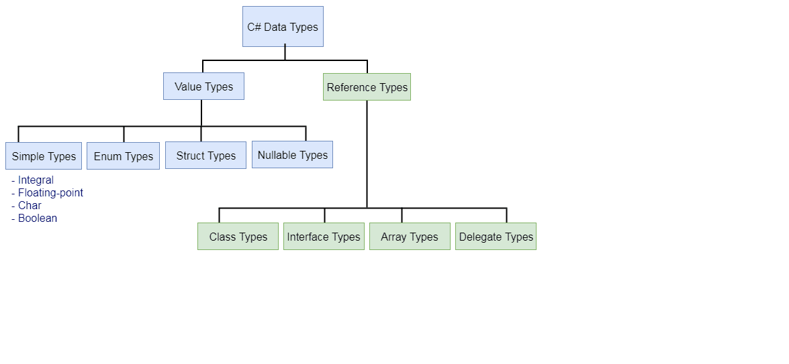

# Vocabulary 

 

# Git

*   **Version Control**: a means for managing your source code
*   **Git:** A **[distributed version-control](https://en.wikipedia.org/wiki/Distributed_version_control) system (DVCS)** for tracking changes in [source code](https://en.wikipedia.org/wiki/Source_code) during [software development](https://en.wikipedia.org/wiki/Software_development).  It is designed for coordinating work among [programmers](https://en.wikipedia.org/wiki/Programmer), but it can be used to track changes in any set of [files](https://en.wikipedia.org/wiki/Computer_file).
*   **Github:** GitHub is where our **Remote repository** will live.  Our computer is where our **Local repository** will live. 
*   **A Commit:** A commit is the Git equivalent of a "save".

## Git Commands:

*   `git init`: initializes a new repository in the current directory
*   `git status`: The git status command displays the state of the working directory and the staging area. It lets you see which changes have been staged, which haven't, and which files aren't being tracked by Git
*   `git clone <remote url goes here>`: puts a copy of the remote repository on our machine 
*   `git push`: push those changes to the remote repository 
    *   You must first use `git push -u origin main` BEFORE you can just use `git push`
*   `git pull`: pulls the latest version of the remote repository to our machine.
*   `git add <filename goes here>`: stages only the specified file
*   `git add .`: stages all files in the directory so they are ready to commit
*   `git commit -m “message goes here”`: commits the changes in the currently staged files and includes a message
*   `git branch`: lists the branches in the repository
*   `git branch <branchName>`: creates a new branch  
*   `git checkout <branchName>`: switches to a specific branch  
*   `git checkout –b <branchName>`: creates a new branch, and switches to that branch at the same time  
*   `git merge <branchName>`: merges a specific branch into the current branch 
*   `git pull`: downloads content from a remote repository and immediately update the local repository to match that content  
*   `git log`: display our commit history 
*   `git diff`: enables you to compare changes in the working directory against a previously committed version
*   `git config --global user.email "youremailaddressgoeshere@gmail.com"`: sets the user email
*   `git config --global user.name "Your Name"`: sets the user name

 

# C#

## C# Command-line

*   **CLI**: The .NET Core command-line interface (CLI) is a new cross-platform toolchain for developing .NET applications. The CLI is a foundation upon which higher-level tools, such as Integrated Development Environments (IDEs), editors, and build orchestrators, can rest. 
*   **Solution file (.sln)** - a solution is a container used by Visual Studio to organize one or more related projects.  When you open a solution in Visual Studio, it automatically loads all the projects the solution contains
*   **Project file (.csproj)** – contains all the source code that is compiled.  It also contains compiler settings and other configuration files
*   **cd**: Command-line command to change directory
*   **mkdir**: Command-line command to create a new folder (directory)

### Dotnet Commands:

*   **dotne**t **&lt;command>**: dotnet is a tool for managing .NET source code and binaries. It exposes commands that perform specific tasks, such as dotnet build and dotnet run.
*   **dotnet new**: Creates a new project, configuration file, or solution based on the specified template.
    *   Example: **dotnet new console ←- creates a new console application for us**
*   **dotnet build**: Builds a project and all of its dependencies.
*   **dotnet run**: Runs source code without any explicit compile or launch commands.
*   **dotnet sln**: The dotnet sln command provides a convenient way to add, remove, and list projects in a solution file.
*   **dotnet test**: The dotnet test command is used to execute unit tests in a given project. The dotnet test command launches the test runner console application specified for a project. The test runner executes the tests defined for a unit test framework (for example, MSTest, NUnit, or xUnit) and reports the success or failure of each test. If all tests are successful, the test runner returns 0 as an exit code; otherwise, if any test fails, it returns 1. _If the project path is not specified, it defaults to the current directory._
    *   Example: **dotnet test ~/projects/test1/test1.csproj**
*   **dotnet clean**: The dotnet clean command cleans the output of the previous build. It's implemented as an MSBuild target, so the project is evaluated when the command is run. Only the outputs created during the build are cleaned. Both intermediate (_obj_) and final output (_bin_) folders are cleaned.

#### 	Bonus (ASP.NET MVC dotnet command): 

*   **mkdir** VS_Code-MVC
*   **cd** VS_Code-MVC
*   **dotnet new mvc**
*   **code .**

**Type the following commands into the terminal**

 

## Value and Reference Types

C# is a strongly AND statically typed object-oriented programming language.

*   **Strongly typed**: once a variable’s type is declared, it cannot change. (Although you can change its value)
*   **Statically typed**: every variable must have a type at compile time.
*   **Signed**: A signed integer is one with either a plus or minus sign  

    in front. (It can be either positive or negative)

*   **Unsigned**: integer is assumed to be positive
*   **The Stack**: The Stack is used for static memory allocation.  This is where Value Types are stored. It utilizes a LAST IN, FIRST OUT procedure.
*   **The Heap**: The Heap is used for dynamic memory allocation. This is where Reference types are stored. Elements can be removed in any order from the heap.
*   **Value Type**: A variable of a value type contains an instance of the type.
*   **Reference Type**: A reference type contains a reference (*pointer) to an instance of the type.

 

## C# Variables

A variable is a memory location. It has a name that is associated with that location. The memory location is used to hold data. The key difference when comparing a constant to a variable is that the value associated with a variable name may change during the execution of the program.

*   **Variable**: A variable is a container for storing value. 
*   **Constant**: A constant is a container for storing a value that never changes.
*   **Variable Name**: A variable name is an identifier for the value stored in a particular location of computer memory
*   **Data Type**: A data type specifies the size and type of variable values.
*   **Camel Case**: The first letter of the first word will be lowercase, for the first time, but uppercase everytime after
    *   Example: camelCaseExample
*   **Pascal Case**: The first letter of every word is uppercase
    *   Example: PascalCaseExample
*   **Declaring a Variable**: To declare a variable, you must specify the data type and the variable name.
    *   Example: string firstName;
*   **Initializing a Variable**: To initialize a variable, you must assign that variable a value
    *   Example: firstName = “John”;
    *   Example: int age = 11; // Declaring and Initializing a variable

 

## C# Operators

*   **Operator**: Operators are special symbols that perform actions on operands
    *   Example : 2 + 2 ( **2** is the operand and **+** is the operator)
*   **Operand**: The quantity on which the operation is performed.
*   **Unary Operator**: An operator with only 1 operand.
    *   Example: x **++**;
    *   Example: **!** isTrue;
    *   Example: **-** **-** x;
*   **Binary Operator**: An operator with 2 operands.
    *   Example: 1 + 1; (**+** is the binary operator)
*   **Ternary Operator**: An operator that requires 3 operands.
    *   Example: var x = x &lt; y ? true : false; (**?** is the ternary operator)
*   **Arithmetic Operators**: These are used to perform arithmetic/mathematical operations on operands.
*   **Relational Operator**s: Relational operators are used for comparison of two values.
*   **Logical Operators**: Logical operators are used to combine two or more conditions or to complement the evaluation of the original condition in consideration.
*   **Assignment Operator**: Assignment operators are used to assign a value to a variable. The left side operand of the assignment operator is a variable and the right side operand of the assignment operator is a value. The value on the right side must be of the same data-type of the variable on the left side otherwise the compiler will raise an error.

 

## Selection Statements

*   **Selection Statement**: Selection statements enable you to branch to different sections of code, depending on one or more specified conditions. The components when concerning selection statements are **if**, **else if**, **else**, and **switch/case**.
*   **switch**: A switch is a selection statement that chooses a single case section to execute based on if the value passed in matches the case conditional. The switch statement is a control statement different from the if statement because it evaluates a single expression against a list of possible cases. The switch statement is often used as an alternative to an if-else construct if a single expression is tested against three or more conditions.
*   **default**: Specifies the code block to run if all else fails.
*   **break**: Terminates the **switch/case** statement.
*   **case**: Each case label specifies a pattern to compare to the match expression. If they match, control is transferred to the switch section that contains the first matching case label. If no case label pattern matches the match expression, control is transferred to the section with the default case label, if there's one. If there's no default case, no statements in any switch section are executed, and control is transferred outside the switch statement.

 

## C# Syntax Sugar

*   **CCR**: Clear, Concise, and Readable
*   **Syntax**: **Syntax** is the grammar for programming
*   **Best Practices**: This is syntax that is not required, but is considered the best thing to do.
    *   Example : Point p = new Point(); // Explicit 
    *   Example : var p = new Point(); // Inferred (best practice)
*   **Syntax Sugar**: This is syntax that is not required and not necessarily best practice, but merely makes coding more convenient or concise.
    *   Example : var isGreater = num1 > num2 ? num1 : num2;
*    **Code Smell**:  Any indicator in a program that a potentially deep-seated issue is present.  (usually subjective and depends on factors including the particular language and experience)
*   **Explicit Typing**: When you specifically say what each variable’s type is.
    *   Example : DateTime day1 = new DateTime
*   **Inferred Typing**: Inferred typing is where the compiler defines the variable’s type by looking at what the variable’s value is and inferring what the most probable type is.

 

## Iteration Statements & Loops

*   **while**: The **while** loop executes a statement or a block of statements while a specified Boolean expression evaluates to true. Because that expression is evaluated before each execution of the loop, a while loop executes zero or more times.
*   **do-while**: The **do-while** loop executes a statement or a block of statements while a specified Boolean expression evaluates to true. Because that expression is evaluated after each execution of the loop, a do-while loop is guaranteed to execute at least one or more times.
*   **for**: The “**for**” loop executes a statement or a block of statements while a specified Boolean expression evaluates to true.
    *   the **initializer** - runs once at the beginning and sets an initial value to serve as a counter     **int i = 0;**
    *   the **conditional** - evaluates before each iteration to determine whether the loop should continue executing     **i &lt; 10;**
    *   the **increment** - after the body of the loop is executed, the increment updates the value of the counter     **i++;**
    *   and the **body**  - the is the block of code the loop will execute.  We also call this the **scope** of the loop     **{  }**
*   **foreach**: A “**foreach**” loop executes a statement or a block of statements for each element in an instance of the type that implements the [System.Collections](https://docs.microsoft.com/en-us/dotnet/api/system.collections.ienumerable).IEnumerable;

Recap:

1. Use a while loop if you need to execute some code until something happens.
2. Use a do-while loop if you need to execute some code at least once, then continue execution until something happens.
3. Use a for loop if you need to execute some code a specific number of times. 
4. Use a foreach loop if you need to execute some code on each element in a collection of elements.

 

## Methods/Functions

**Method**: A method, or function, helps you separate your code into modules that perform a given task... You execute this code by calling the Method. In C# a method consists of a few things:

*   **Access Modifiers**: Access modifiers are keywords used to specify the declared accessibility of a member or a type.
*   **Return Type**: the type returned by the method, or void when not returning anything
    *   **void**: **void** is the absence of a return type
*   **Name**: a descriptive method name using PascalCase
    *   **PascalCase**: every first letter of every word is capitalized
*   **Parameters**: an optional list of variables to be passed to the method
*   **Scope/Body**: the block of code to be executed when the method is called
*   **Argument**: the value you pass into the function when it is being called

 

## Method Overloading

*   **Method Overloading**: When multiple methods share the same name but have a different signature
    *   1. The number of parameters
    *   2. The order of the parameters
    *   3. The data types of the parameters
*   **Signature**: A method signature is a unique identification of a method for the C# compiler. The signature consists of a method name and the type and kind (value, reference, or output) of each of its formal parameters. Method signature does not include the return type.
*   **Rules for overloading a method**
    *   Where a parameter represents the same value as that in another method, the parameters should have the same name.
    *   Parameters with the same name should appear in the same position in each method’s parameter list.
    *   You should not use ref or out modifiers to overload methods.
    *   You cannot overload method declarations that differ only by return type.

 

## Arrays & Lists

*   **Arrays**: Arrays are used to store multiple values in a single variable, instead of declaring separate variables for each value. In C#, arrays are actually objects, and not just addressable regions of contiguous memory as in C and C++. Therefore, using dot notation, you have access to the properties and methods of the abstract [Array](https://docs.microsoft.com/en-us/dotnet/api/system.array?view=net-5.0) class.
*   **Collections**: Collections provide a more flexible way to work with groups of objects. Unlike arrays, the group of objects you work with can grow and shrink dynamically as the needs of the application change. For some collections, you can assign a key to any object that you put into the collection so that you can quickly retrieve the object by using the key.

 

## Classes

Before classes and Object-Oriented Programming was a thing, programmers used functional programming as a programming paradigm...

*   **Functional Programming**: Functional programming allows building a program using mathematical functions. In other words, it binds the program into a purely mathematical function. Using functional programming, the developer can build a program as a combination of separate mathematical functions.
*   **Object-Oriented Programming**: Object-oriented programming (OOP) is a [programming paradigm](https://en.wikipedia.org/wiki/Programming_paradigm) based on the concept of "[objects](https://en.wikipedia.org/wiki/Object_(computer_science))", which can contain [data](https://en.wikipedia.org/wiki/Data) and code: data in the form of [fields](https://en.wikipedia.org/wiki/Field_(computer_science)) (often known as attributes or properties), and code, in the form of procedures (often known as [methods](https://en.wikipedia.org/wiki/Method_(computer_science))).
*   **Class**: Classes are the cornerstone of Object-Oriented Programming. They help you take all the properties and behaviors of an object in your program, and combine them into a single object, then re-use that object wherever you need it in your program. Using classes in your code enables you to implement **Encapsulation, Abstraction, Inheritance, and Polymorphism**.
*   **Object**: An object is defined as a singular instance of a class or type. A class can be thought of as a blueprint or a cookie cutter. A class describes an object, but it is not that object.

*   **Class Members**: Classes have members sort of like how methods have variables; however, classes are not only limited to variables. Examples:
    *   **Fields** - a variable of any type that is declared directly in a class or struct.
    *   **Properties** - a member that provides a mechanism to read, write, or compute the value of a private field.
    *   **Methods** - a code block that contains a series of statements to execute.
    *   **Constructors** - Whenever a class or struct is created, its constructor is called.
*   **Dot Notation**: The way we access the methods and properties of a class is with the ( . ) **Dot** operator, Dot Notation, or Class Member Access Operator.

    **Parts of a class**

1. **Access Modifier** Keywords - **OPTIONAL**
2. **class** keyword - **REQUIRED**
3. **Name** - **REQUIRED**
4. **Scope** or “curly brackets” - **REQUIRED**
    1. **Fields/Properties** - **OPTIONAL**
    2. **Methods** - **OPTIONAL**

 

## Encapsulation

