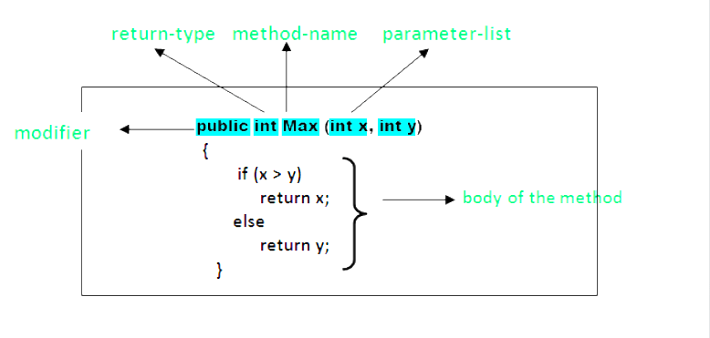
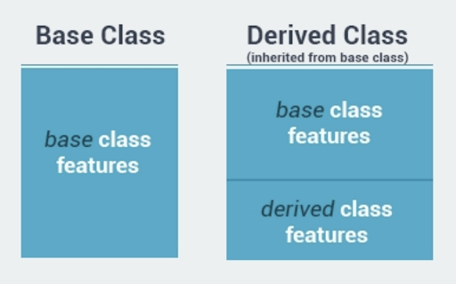
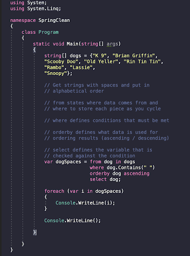
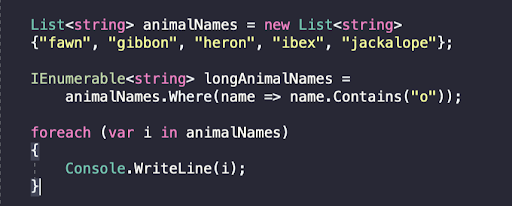
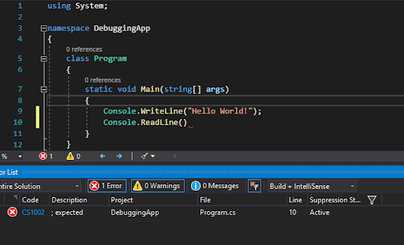
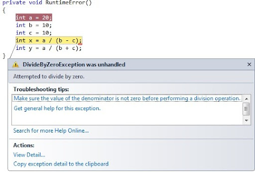
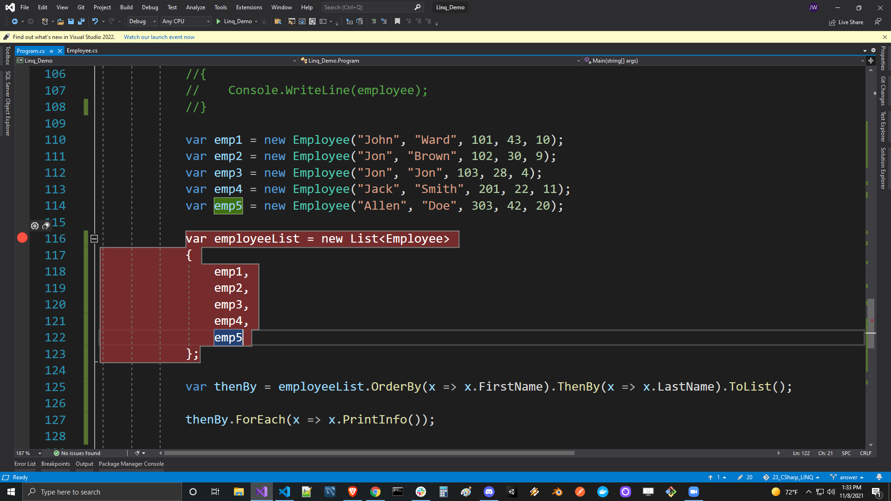
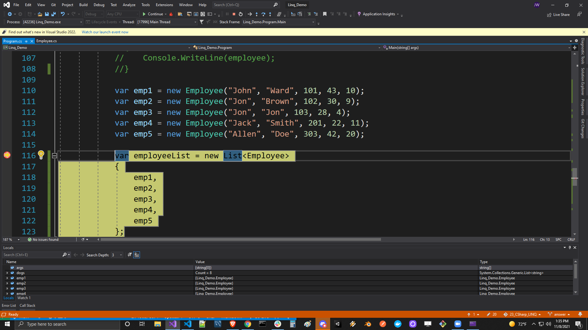
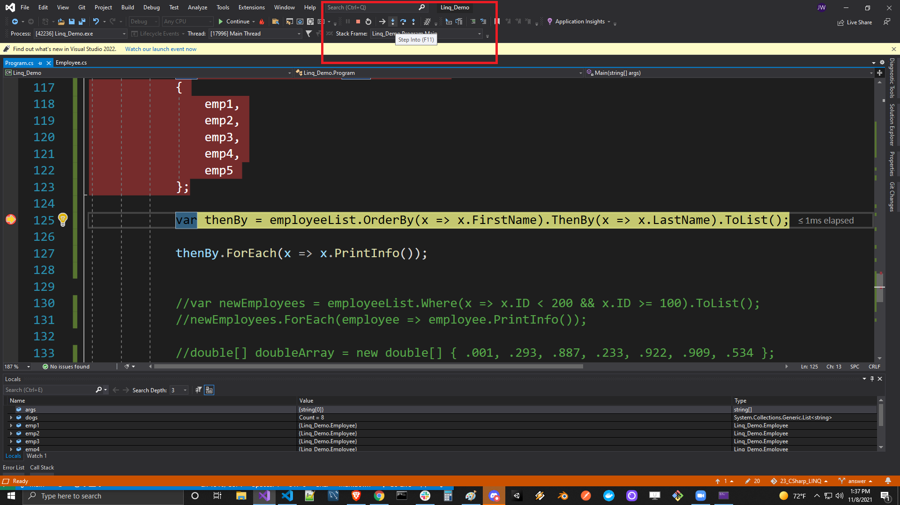
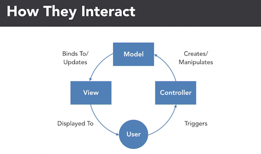

# C# Software Development Review


|**Git**|**C#**|**SQL**|**HTML**|**CSS**|**JavaScript**|
|---|---|---|---|---|---|
|   |  |   |  |    | |

<br>

### Table of Contents:

**[Git Commands](#git-commands)**<br>
**[C# Command-line](#csharp-command-line)**<br>
**[Dotnet Commands](#dotnet-commands)**<br>
**[Value and Reference Types](#value-and-reference-types)**<br>
**[C# Variables](#csharp-variables)**<br>
**[C# Operators](#csharp-operators)**<br>
**[Selection Statements](#selection-statements)**<br>
**[C# Syntax Sugar](#csharp-syntax-sugar)**<br>
**[Iteration Statements & Loops](#iteration-statements-and-loops)**<br>
**[Methods](#methods)**<br>
**[Method Overloading](#method-overloading)**<br>
**[Arrays & Lists](#arrays-and-lists)**<br>
**[Classes](#classes)**<br>
**[Encapsulation](#encapsulation)**<br>
**[Inheritance](#inheritance)**<br>
**[Static Keyword](#static-keyword)**<br>
**[Abstract Classes](#abstract-classes)**<br>
**[Interfaces](#interfaces)**<br>
**[Factory Pattern](#factory-pattern)**<br>
**[LINQ](#linq)**<br>
**[Debugging](#debugging)**<br>
**[Exception Handling](#exception-handling)**<br>
**[Test Driven Development](#test-driven-development)**<br>
**[SQL Intro](#sql-intro)**<br>
**[SQL Joins](#sql-joins)**<br>
**[C# ORM and Dapper](#csharp-orm-and-dapper)**<br>
**[APIs and JSON](#apis-and-json)**<br>
**[IDE Parts: Google Chrome Inspector](#google-chrome-inspector)**<br>
**[HTML Intro](#html-intro)**<br>
**[CSS Intro](#css-intro)**<br>
**[JS Intro](#javascript-intro)**<br>
**[ASP.NET Core MVC](#mvc)**<br>

<br>

## Git

- **Version Control**: a means for managing your source code
- **Git:** A **[distributed version-control](https://en.wikipedia.org/wiki/Distributed_version_control) system (DVCS)** for tracking changes in [source code](https://en.wikipedia.org/wiki/Source_code) during [software development](https://en.wikipedia.org/wiki/Software_development). It is designed for coordinating work among [programmers](https://en.wikipedia.org/wiki/Programmer), but it can be used to track changes in any set of [files](https://en.wikipedia.org/wiki/Computer_file).
- **Github:** GitHub is where our **Remote repository** will live. Our computer is where our **Local repository** will live.
- **A Commit:** A commit is the Git equivalent of a "save".

<br>
<br>
<br>

## Git Commands:

- `git init`: initializes a new repository in the current directory
- `git status`: The git status command displays the state of the working directory and the staging area. It lets you see which changes have been staged, which haven't, and which files aren't being tracked by Git
- `git clone <remote url goes here>`: puts a copy of the remote repository on our machine
- `git push`: push those changes to the remote repository
  - You must first use `git push -u origin main` BEFORE you can just use `git push`
- `git pull`: pulls the latest version of the remote repository to our machine.
- `git add <filename goes here>`: stages only the specified file
- `git add .`: stages all files in the directory so they are ready to commit
- `git commit -m "message goes here"`: commits the changes in the currently staged files and includes a message
- `git branch`: lists the branches in the repository
- `git branch <branchName>`: creates a new branch
- `git checkout <branchName>`: switches to a specific branch
- `git checkout –b <branchName>`: creates a new branch, and switches to that branch at the same time
- `git merge <branchName>`: merges a specific branch into the current branch
- `git pull`: downloads content from a remote repository and immediately update the local repository to match that content
- `git log`: display our commit history
- `git diff`: enables you to compare changes in the working directory against a previously committed version
- `git config --global user.email "YourEmailAddressGoesHere@gmail.com"`: sets the user email
- `git config --global user.name "Your Name"`: sets the user name

<br>
<br>
<br>

## Csharp Command-line

- **CLI**: The .NET Core command-line interface (CLI) is a new cross-platform toolchain for developing .NET applications. The CLI is a foundation upon which higher-level tools, such as Integrated Development Environments (IDEs), editors, and build orchestrators, can rest.
- **Solution file (.sln)** - a solution is a container used by Visual Studio to organize one or more related projects. When you open a solution in Visual Studio, it automatically loads all the projects the solution contains
- **Project file (.csproj)** – contains all the source code that is compiled. It also contains compiler settings and other configuration files
- `cd`: Command-line command to change directory
- `mkdir`: Command-line command to create a new folder (directory)

### Dotnet Commands:

- `dotnet <command>`: dotnet is a tool for managing .NET source code and binaries. It exposes commands that perform specific tasks, such as dotnet build and dotnet run.
- `dotnet new`: Creates a new project, configuration file, or solution based on the specified template.
  - Example: `dotnet new console` ←- creates a new console application for us
- `dotnet build`: Builds a project and all of its dependencies.
- `dotnet run`: Runs source code without any explicit compile or launch commands.
- `dotnet sln`: The dotnet sln command provides a convenient way to add, remove, and list projects in a solution file.
- `dotnet test`: The dotnet test command is used to execute unit tests in a given project. The dotnet test command launches the test runner console application specified for a project. The test runner executes the tests defined for a unit test framework (for example, MSTest, NUnit, or xUnit) and reports the success or failure of each test. If all tests are successful, the test runner returns 0 as an exit code; otherwise, if any test fails, it returns 1. _If the project path is not specified, it defaults to the current directory._
  - Example: `dotnet test ~/projects/test1/test1.csproj`
- `dotnet clean`: The dotnet clean command cleans the output of the previous build. It's implemented as an MSBuild target, so the project is evaluated when the command is run. Only the outputs created during the build are cleaned. Both intermediate (_obj_) and final output (_bin_) folders are cleaned.

#### Bonus (ASP.NET MVC dotnet command):

```bash
mkdir VS_Code-MVC
cd VS_Code-MVC
dotnet new mvc
code .
```

**<span style="text-decoration:underline;">Type the following commands into the terminal</span>**

<br>
<br>
<br>

## Value and Reference Types

C# is a strongly AND statically typed object-oriented programming language.

- **Strongly typed**: once a variable’s type is declared, it cannot change. (Although you can change its value)
- **Statically typed**: every variable must have a type at compile time.
- **Signed**: A signed integer is one with either a plus or minus sign in front. (It can be either positive or negative)
- **Unsigned**: integer is assumed to be positive
- **The Stack**: The Stack is used for static memory allocation. This is where Value Types are stored. It utilizes a LAST IN, FIRST OUT procedure.
- **The Heap**: The Heap is used for dynamic memory allocation. This is where Reference types are stored. Elements can be removed in any order from the heap.
- **Value Type**: A variable of a value type contains an instance of the type.
- **Reference Type**: A reference type contains a reference (\*pointer) to an instance of the type.


<br>
<br>
<br>

## Csharp Variables

A variable is a memory location. It has a name that is associated with that location. The memory location is used to hold data. The key difference when comparing a constant to a variable is that the value associated with a variable name may change during the execution of the program.

- **Variable**: A variable is a container for storing value.
- **Constant**: A constant is a container for storing a value that never changes.
- **Variable Name**: A variable name is an identifier for the value stored in a particular location of computer memory
- **Data Type**: A data type specifies the size and type of variable values.
- **Camel Case**: The first letter of the first word will be lowercase, for the first time, but uppercase everytime after
  - Example:
  ```cs
  string camelCaseExample;
  ```
- **Pascal Case**: The first letter of every word is uppercase
  - Example:
  ```cs
  string PascalCaseExample;
  ```

<br>

### **Declaring a Variable**
To declare a variable, you must specify the data type and the variable name.

  ```cs
  string firstName;
  ```

### **Initializing a Variable**
To initialize a variable, you must assign that variable a value

  ```cs
  firstName = "John";
  ```

### **Declaring and Initializing a variable**
  ```cs
  int age = 11; // Declaring and Initializing a variable
  ```

<br>
<br>
<br>

## Csharp Operators

- **Operator**: Operators are special symbols that perform actions on operands
  - Example : `2 + 2` ( **2** is the operand and **+** is the operator)
- **Operand**: The quantity on which the operation is performed.
- **Unary Operator**: An operator with only 1 operand.
  - Example: `x++`
  - Example: `!isTrue;`
  - Example: `--x;`
- **Binary Operator**: An operator with 2 operands.
  - Example: `1 + 1`; (**+** is the binary operator)
- **Ternary Operator**: An operator that requires 3 operands.
  ```cs
  var answer = x < y ? true : false;  // ? is the ternary operator
  ```
<br>

### Arithmetic Operators: 

These are used to perform arithmetic/mathematical operations on operands.

```cs
int num1 = 0;
int num2 = 10;

int answer = num1 + num2; // Add
answer = num1 - num2; // Subtract
answer = num1 * num2; // Multiply
answer = num1 / num2; // Divide
answer = num1 % num2; // Modulus (gets the remainder after division)
answer = Math.Pow(num1, num2); // Exponent (the first number raised to the second number)
```
<br>

### Relational Operators:

Relational operators are used for comparison of two values.

```cs
int num1 = 0;
int num2 = 1;

bool isGreater = num1 > num2; // greater than... false
isGreater = num1 < num2; // less than... true
isGreater = num1 >= num2; // greater than OR equal to... false
isGreater = num1 <= num2; // less than OR equal to... true
```
<br>

### Logical Operators:

Logical operators are used to combine two or more conditions or to complement the evaluation of the original condition in consideration.

### `&&` **Logical AND**

```cs
int x = 10;
int y = 11;
// the left expression AND the right expression must evaluate to be TRUE in order for the code to be run
if (x < y && x == 10)
{
    x++; // both conditions are true so the code runs
}
```

### `||` **Logical OR**

```cs
int x = 10;
int y = 20;
// the left expression OR the right expression must evaluate to be TRUE in order for the code to be run
if (x > y && x == 10)
{
    x++; // code still runs even though x is not less than y
}
```

### `!` **Logical NOT**

```cs
bool isPresent = true;
// the NOT operator ! flips the value to the opposite one

Console.WriteLine(!isPresent); // outputs false
```
<br>

### Assignment Operator:
Assignment operators are used to assign a value to a variable. The left side operand of the assignment operator is a variable and the right side operand of the assignment operator is a value.
  > Note: The **value** on the right side must be of the same **data-type** as the variable on the left side, otherwise the compiler will raise an error.

```cs
int x = 100; // = is the simple assignment operator
int y = 200;

x += y; // same as long form x = x + y;
x -= y; // same as long form x = x - y;
x *= y; // same as long form x = x * y;
x /= y; // same as long form x = x / y;
x %= y; // same as long form x = x % y;
```

<br>

### Null Coalescing Operator:

The null coalescing operator allows you to conditionally evaluate an expression, providing a fallback value in the event that the expression is null.

> Note: Only available in C# 8.0 and later

#### Syntax:

```cs
var exampleValue = possiblyNullValue ?? someDefaultValue;
```

#### Explanation

- In the above example, exampleValue is set to possiblyNullValue if it is non-null, otherwise it is set to someDefaultValue.
- If someDefaultValue is also null, exampleValue will be set to null.

<br>

### Null-Conditional Operator:

The null-conditional operator applies an operation to its operand only if that operand is non-null. Otherwise the result of applying the operator is null.

> Note: Only available in C# 8.0 and later

#### Example

```cs
var exampleList = new List<string>();
var exampleValue = exampleList?.Add("myString");
```

#### Explanation

- In the above example, exampleValue will be a list with one value, myString.
- If exampleList had been null, i.e. if the first line had been `var exampleList = null;`, exampleValue would have been set to null.

<br>
<br>
<br>

## Selection Statements

**Selection statements** enable you to branch to different sections of code, depending on one or more specified conditions. The components when concerning selection statements are **if**, **else if**, **else**, and **switch/case**.

### `if`

```cs
bool condition = true;

if (condition)
{
    Console.WriteLine("Because the condition was true this code IS executed");
}
```

```cs
int x = 10;
int y = 11;

if (x == y)
{
    Console.WriteLine("This code IS NOT run because the condition evaluated to false");
}
```

### `if / else`

```cs
int num1 = 20;
int num2 = 30;

if(num1 == num2)
{
    Console.WriteLine("The condition is false therefore this code IS NOT executed");
}
else
{
    Console.WriteLine("The above condition was false so the code in this scope IS executed ");
}
```

### `if / else if / else`

```cs
int x = 1;
int y = 2;
int z = 3;

if (x > y || y > z)
{
    Console.WriteLine("The condition is false therefore this code IS NOT executed");
}
else if (z < y || z < x)
{
    Console.WriteLine("The condition here is also false therefore this code IS NOT executed");
}
else
{
    Console.WriteLine("If all conditions are false, then this code IS executed");
}
```
<br>

### `switch/case`

- `switch/case`: A switch is a selection statement that chooses a single case section to execute based on if the value passed in matches the case conditional. The switch statement is a control statement different from the if statement because it evaluates a single expression against a list of possible cases. <span style="text-decoration:underline;">The switch statement is often used as an alternative to an if-else construct if a single expression is tested against three or more conditions.</span>
- `default`: Specifies the code block to run if all else fails.
- `break`: Terminates the **switch/case** statement.
- `case`: Each case label specifies a pattern to compare to the match expression. If they match, control is transferred to the switch section that contains the first matching case label. If no case label pattern matches the match expression, control is transferred to the section with the default case label, if there's one. If there's no default case, no statements in any switch section are executed, and control is transferred outside the switch statement.

```cs
int day = 4;

switch (day)
{
    case 0:
        Console.WriteLine("Sunday");
        break;
    case 1:
        Console.WriteLine("Monday");
        break;
    case 2:
        Console.WriteLine("Tuesday");
        break;
    case 3:
        Console.WriteLine("Wednesday");
        break;
    case 4:
        Console.WriteLine("Thursday");
        break;
    case 5:
        Console.WriteLine("Friday");
        break;
    case 6:
        Console.WriteLine("Saturday");
        break;
} // outputs Thursday
```

---

```cs
public interface ICallable
{
    public ICallable GetPhone();
}

public class PhoneFactory : ICallable
{
    public static ICallable GetPhone(string phoneType)
    {
        switch (phoneType.ToLower())
        {
            case "android":
                return new AndroidPhone();
            case "apple":
            case "iphone":
                return new ApplePhone();
            case "google":
                return new GooglePhone();
            default:
                return new AndroidPhone();
        }
    }
}
```

<br>
<br>
<br>

## Csharp Syntax Sugar

- **CCR**: Clear, Concise, and Readable
- **Syntax**: the grammar for programming

<br>

- **Best Practices**: This is syntax that is not required, but is considered the best thing to do.

```cs
Point p = new Point(); // Explicit
var p = new Point(); // Inferred (best practice)
```
<br>

- **Syntax Sugar**: This is syntax that is not required and not necessarily best practice, but merely makes coding more convenient or concise.

```cs
    var isGreater = num1 > num2 ? num1 : num2;
```
<br>

- **Code Smell**: Any indicator in a program that a potentially deep-seated issue is present. (usually subjective and depends on factors including the particular language and experience)

<br>

- **Explicit Typing**: When you specifically say what each variable’s type is.

```cs
DateTime d = new DateTime();
Console.WriteLine(d.ToLongDateString());
```
<br>

- **Inferred Typing**: Inferred typing is where the compiler defines the variable’s type by looking at what the variable’s value is and inferring what the most probable type is.

```cs
var x = 10; // var -> int
var y = true; // var -> bool
var z = new List<int>(); // var -> List<int>
```

<br>
<br>
<br>

## Iteration Statements and Loops

- `while`: The **while** loop executes a statement or a block of statements while a specified Boolean expression evaluates to true. Because that expression is evaluated before each execution of the loop, a while loop executes zero or more times.

```cs
int counter = 5;

while (counter > 0)
{
    Console.Write($"{counter} "); // outputs => 5 4 3 2 1
    counter--;
}
```

<br>
<br>

- `do-while`: The **do-while** loop executes a statement or a block of statements while a specified Boolean expression evaluates to true. Because that expression is evaluated after each execution of the loop, a do-while loop is guaranteed to execute at least one or more times.

```cs
int counter = 5;
do
{
    Console.Write($"{counter} "); // outputs => 5 4 3 2 1
    counter--;
}
while(counter > 0);
```

<br>
<br>

- `for`: The “**for**” loop executes a statement or a block of statements while a specified Boolean expression evaluates to true.
  - the **initializer** - runs once at the beginning and sets an initial value to serve as a counter **int i = 0;**
  - the **conditional** - evaluates before each iteration to determine whether the loop should continue executing **i &lt; 10;**
  - the **increment** - after the body of the loop is executed, the increment updates the value of the counter **i++;**
  - and the **body** - the is the block of code the loop will execute. We also call this the **scope** of the loop **{ }**

```cs
for(int i = 5; i > 0; i--)
{
    Console.Write($"{i} "); // outputs => 5 4 3 2 1
}
```

<br>
<br>

- `foreach`: A “**foreach**” loop executes a statement or a block of statements for each element in an instance of the type that implements the [System.Collections](https://docs.microsoft.com/en-us/dotnet/api/system.collections.ienumerable).IEnumerable;

```cs
var myList = new List<int>() {5, 4, 3, 2, 1 };
foreach (var num in myList)
{
    Console.Write($"{num} "); // outputs => 5 4 3 2 1
}
```

### Recap:

- Use a while loop if you need to execute some code until something happens.
- Use a do-while loop if you need to execute some code at least once, then continue execution until something happens.
- Use a for loop if you need to execute some code a specific number of times.
- Use a foreach loop if you need to execute some code on each element in a collection of elements.

<br>
<br>
<br>

## Methods

**Method**: A method, or function, helps you separate your code into modules that perform a given task... You execute this code by calling the Method. In C# a method consists of a few things:

- **Access Modifiers**: Access modifiers are keywords used to specify the declared accessibility of a member or a type.
- **Return Type**: the type returned by the method, or void when not returning anything
  - **void**: **void** is the absence of a return type
- **Name**: a descriptive method name using PascalCase
  - **PascalCase**: every first letter of every word is capitalized
- **Parameters**: an optional list of variables to be passed to the method
- **Scope/Body**: the block of code to be executed when the method is called
- **Argument**: the value you pass into the function when it is being called




```cs
// Declaring a public Add Method that accepts 2 whole numbers

public int Add(int x, int y)
{
    return x + y;
}
```

<br>

```cs
// Declaring a public Greet Method that accepts 2 strings

public void Greet(string firstName, string lastName)
{
    Console.WriteLine($"Hello, {firstName} {lastName}!");
}
```

<br>

```cs
// Declaring a public AddSpaces Method that accepts 1 integer

public void AddSpaces(int numberOfSpaces)
{
    while(numberOfSpaces > 0)
    {
        Console.WriteLine();
        numberOfSpaces--;
    }
}
```

<br>
<br>

### Other useful methods:
```cs
// Console class common methods
Console.WriteLine();
Console.Write();
Console.ReadLine();

// Math class common methods
Math.Pow();
Math.Round();

// parse methods
int.Parse();
Convert.ToInt32();
int.TryParse();

// string methods
.ToString();
.ToUpper();

```

<br>
<br>
<br>

## Method Overloading

- **Method Overloading**: When multiple methods share the same name but have a different signature
  - The number of parameters
  - The order of the parameters
  - The data types of the parameters
- **Signature**: A method signature is a unique identification of a method for the C# compiler. The signature consists of a method name and the type and kind (value, reference, or output) of each of its formal parameters. Method signature does not include the return type.


- **Rules for overloading a method**
  - Where a parameter represents the same value as that in another method, the parameters should have the same name.
  - Parameters with the same name should appear in the same position in each method’s parameter list.
  - You should not use ref or out modifiers to overload methods.
  - You cannot overload method declarations that differ only by return type.

### Method Overloading Examples `Console.WriteLine();`


<br>
<br>
<br>

## Arrays and Lists

<br>
<br>

### Arrays:

Arrays are used to store multiple values in a single variable, instead of declaring separate variables for each value. In C#, arrays are actually objects, and not just addressable regions of contiguous memory as in C and C++. Therefore, using dot notation, you have access to the properties and methods of the abstract [Array](https://docs.microsoft.com/en-us/dotnet/api/system.array?view=net-5.0) class.

<br>

### Declaring and Initializing Arrays:

```cs
// Example 1 => Declaring an int array of size 3 (explicitly)
int[] myArray1 = new int[3];

// Example 1 => Initializing each of the array's indices
myArray1[0] = 10;
myArray1[1] = 20;
myArray1[2] = 30;

// Example 2 => Declaring and initializing an int array (at the same time)
int[] myArray2 = new int[3] { 3, 2, 1 };

// Example 3 => Declaring and initialzing an int array (no size specification)
int[] myArray3 = new int[] {4, 5, 6, 7, 8, 9};

// Example 4 => Declaring and initializing an int array (implicitly)
var myArray4 = new int[] { 10, 11, 12 };

// Example 5 => Shorthand Syntax
int[] myArray5 = { 100, 200, 300 };
```

### Accessing Elemets of Arrays:

```cs
string[] cars = { "Tesla", "Ford", "Honda", "Toyota" };

// To access an element inside an array, use the name of the array with bracket [] notation

Console.WriteLine(cars[0]); // 0 is the first index so the output is: Tesla
Console.WriteLine(cars[2]); // output: Honda

// You can run expressions inside of the brackets as long as that expression evaluates to an INTEGER
Console.WriteLine(cars[cars.Length - 1]); // output: Toyota
// cars.Length = 4 so we subtract 1 to get the 3rd index or the last element in the array

Console.WriteLine(cars[4]); // throws an exception (System.IndexOutOfRangeException)
```

> Note: An array is a type of collection

<br>
<br>

### Lists

Lists provide a more flexible way to work with groups of objects. Unlike arrays, the group of objects you work with can grow and shrink dynamically as the needs of the application change. For some collections, you can assign a key to any object that you put into the collection so that you can quickly retrieve the object by using the key.

<br>

### Declaring and Initializing Lists:

```cs
public class Person
{
    public string FirstName {get; set;}
    public string LastName {get; set;}

    public Person(string firstName, string lastName)
    {
        FirstName = firstName;
        LastName = lastName;
    }
}

// Declaring an empty List of type int called numbers
var numbers = new List<int>();

// Declaring and Initializing a list of string called myList with 3 string values
var myList = new List<string>() { "The 1st string","The 2nd string", "The 3rd string" };

// Declaring and Initializing a list of Person Objects called people (object initializer syntax)
var people = new List<Person>()
{
    new Person("John", "Ward"),
    new Person("Jon", "Doe"),
    new Person("Jane", "Doe")
}
```

### Looping through Arrays and Lists:

```cs
// Declaring/Initializing an int array called numbers then looping through it 1 by 1 and printing out each element to the console
var evenNumbers = new int[] { 0, 2, 4, 6, 8, 10 };

for (int i = 0; i < evenNumbers.Length; i++)
{
    Console.Write(evenNumbers[i]); // outputs => 0246810
}
```

```cs
// Declaring/Initializing a list of ints called oddNumbers then looping through it 1 by 1 and printing out each element to the console
var oddNumbers = new List<int>() { 1, 3, 5, 7, 9, 11 };

foreach (var num in oddNumbers)
{
    Console.Write(num); // outputs => 1357911
}
```

> Note: A List is another type of collection

<br>
<br>
<br>

## Classes

Before classes and Object-Oriented Programming was a thing, programmers used functional programming as a programming paradigm...

- **Functional Programming**: Functional programming allows building a program using mathematical functions. In other words, it binds the program into a purely mathematical function. Using functional programming, the developer can build a program as a combination of separate mathematical functions.
- **Object-Oriented Programming**: Object-oriented programming (OOP) is a [programming paradigm](https://en.wikipedia.org/wiki/Programming_paradigm) based on the concept of "[objects](<https://en.wikipedia.org/wiki/Object_(computer_science)>)", which can contain [data](https://en.wikipedia.org/wiki/Data) and code: data in the form of [fields](<https://en.wikipedia.org/wiki/Field_(computer_science)>) (often known as attributes or properties), and code, in the form of procedures (often known as [methods](<https://en.wikipedia.org/wiki/Method_(computer_science)>)).
- **Class**: Classes are the cornerstone of Object-Oriented Programming. They help you take all the properties and behaviors of an object in your program, and combine them into a single object, then re-use that object wherever you need it in your program. Using classes in your code enables you to implement **Encapsulation, Abstraction, Inheritance, and Polymorphism**.
- **Object**: An object is defined as a singular instance of a class or type. A class can be thought of as a **blueprint**, a **template** or a **cookie cutter**. A class describes an object, but it is not that object.

- **Class Members**: Classes have members sort of like how methods have variables; however, classes are not only limited to variables. Examples:

  - **Fields** - a variable of any type that is declared directly in a class or struct.
  - **Properties** - a member that provides a mechanism to read, write, or compute the value of a private field.
  - **Methods** - a code block that contains a series of statements to execute.
  - **Constructors** - Whenever a class or struct is created, its constructor is called.

- **Dot Notation**: The way we access the methods and properties of a class is with the ( . ) **Dot** operator, Dot Notation, or Class Member Access Operator.

### Parts of a class

1. **Access Modifier** Keywords - **OPTIONAL**
2. **class** keyword - **REQUIRED**
3. **Name** - **REQUIRED**
4. **Scope** or “curly brackets” - **REQUIRED**
   1. **Fields/Properties** - **OPTIONAL**
   2. **Methods** - **OPTIONAL**

```cs
class Cat // the access modifier is optional (will default to internal)
{ // opening curly brace

    // class members (will default to private)
    // Methods
    // Properties
    // Fields
    // Constructors
    // Etc...

} // closing curly brace
```

- Dog Class Example

```cs
using System;

namespace Class_Demo
{
    public class Dog
    {
        // Constructors
        public Dog()
        {

        }

        // Fields
        private int _id;
        private string _name;
        private readonly IDbConnection _conn;

        // Properties
        public int Age {get; set;}
        public DateTime BirthDay {get; set;}

        // Methods
        public void Bark()
        {
            Console.WriteLine("Woof woof");
        }
    }

    public class Program
    {
        static void Main(string[] args)
        {
            // (Creating an instance of type Dog), (Instantiating a dog object), etc...
            Dog dog1 = new Dog();

            // We access the class members of the object using dot notation ( . )
            dog1.Birthday = DateTime.Now;
            dog1.Bark();
        }
    }
}
```

<br>
<br>
<br>

## Encapsulation

#### Encapsulation means, that a group of related properties, methods, and other members are treated as a single unit or object.

#### The key advantage of using an Object Oriented Programming language like C# is that it provides your code security, flexibility, and easy maintainability through encapsulation. Encapsulation is also useful in hiding the data (instance variables) of a class from illegal direct access.

#### Encapsulation is one of the 4 pillars of Object Oriented Programming.

> Note: Encapsulation is also called information hiding.

- An easy way to remember the 4 pillars is this acronymn: **OOPs A PIE**

  - **O**bject
  - **O**riented
  - **P**rogramming
  - **A**bstraction
  - **P**olymorphism
  - **I**nheritance
  - **E**ncapsulation

---

### We can implement Encapsulation by using Access Modifiers.

C# supports the following access modifiers:

`public` - access modifier makes the member accessible from outside of the class

`private` - makes members accessible only from within the class it was created in and hides the member from the outside

`protected` - the member can only be accessed by code in the same class or in a derived class

`internal` - the member can be accessed by any code in the same assembly, but not from another assembly

`protected internal` - the member can be accessed by any code in the same assembly, or by any derived class in another assembly

<br>

## Encapsulation Example Below

- Encapsulation is used to restrict access to members of a
  class so as to prevent the user of a given class from
  manipulating objects in ways that are not intended by the
  Designer.

- Encapsulation hides the internal implementation of
  functionalities of a class without affecting the overall
  functioning of the system.

- It allows the class to service a request for functionality and
  add or modify its internal structure (data or methods) to
  suit changing requirement.

```cs
public class PersonalInfo
{
    private readonly int _ssn; // this Field is 'private' (only accessible inside this class) AND 'readonly' (you can't modify after it's been set {after initialization})

    public Personal_Info(int ssn) // this constructor sets the private Field _ssn upon instantiation
    {
        _ssn = ssn;
    }

    public void Show_SSN(int ssn) // this is the 'public' facing method used to display the ENCAPSULATED Field
    {
        Console.WriteLine($"SSN: {ssn}");
    }
}
```

<br>
<br>
<br>

## Inheritance

**Inheritance**, together with **encapsulation**, **abstraction**, and **polymorphism**, is one of the four pillars of **object-oriented programming**.

### Inheritance enables you to create new classes that reuse, extend, and modify the behavior that is defined in other classes.



```cs
public class BankAccount
{
    public long AccountNumber {get; set;}
    public decimal Balance {get; set;}
    public DateTime DateOpened {get; set;}
    public string AccountType {get; set;}
}

public class CheckingAccount : BankAccount
{
    public int ChecksOrdered {get; set;}
    public bool IssuedDebitCard {get; set;}
}

public class Program
{
    static void Main(string[] args)
    {
        var bankAccount1 = new BankAccount(); // Base Class
        Console.WriteLine(bankAccount1.AccountNumber);
        Console.WriteLine(bankAccount1.Balance);
        Console.WriteLine(bankAccount1.DateOpened);
        Console.WriteLine(bankAccount1.AccountType);

        var checkingAccount1 = new CheckingAccount(); // Derived Class
        Console.WriteLine(checkingAccount1.AccountNumber);
        Console.WriteLine(checkingAccount1.Balance);
        Console.WriteLine(checkingAccount1.DateOpened);
        Console.WriteLine(checkingAccount1.AccountType);
        Console.WriteLine(checkingAccount1.ChecksOrdered);
        Console.WriteLine(checkingAccount1.IssuedDebitCard);
    }
}
```

<br>
<br>
<br>

## Static Keyword

In code when we create an instance of a class we are allocating a certain amount of memory for that object to reference. We may have a class that performs a particular function or method in multiple parts of our code. As a programmer, you should always strive to have the most efficient and readable code possible. Instead of instantiating the object and allocating the memory every time in our code just to invoke a couple of methods; we can use the static keyword.

### So what is static? Static simply means that when applied to a class member, it belongs to the type/class itself and not to the object instance.

```cs
using System;

namespace InheritanceDemo
{
    public class Teacher
    {
        public string Name {get; set;}
        public static string Subject {get; set;}
    }

    public class Program
    {
        static void Main(string[] args)
        {
            Teacher t = new Teacher(); // Teacher instance
            t.Name = "Some Teacher's Name"; // instance property

            Teacher.Subject = "C#"; // static property
        }
    }
}
```

Another example of using a static class and static class methods, one we all should be pretty familiar with by now, is `System.Console` i.e. `Console.WriteLine()` and `Console.ReadLine()`. We do not need to create a console object to just print something to the console, we just call the static method **WriteLine()** to do that for us.


<br>
<br>
<br>

## Abstract Classes

Abstract classes have the following features:

- An abstract class cannot be instantiated.
- An abstract class may contain abstract methods and accessors.
- A non-abstract class derived from an abstract class must include actual implementations of all inherited abstract methods and accessors.


So in essence, an abstract class acts as a stubbed-out template class that other classes will derive from and use as an incomplete base. The derived class will define its own way to complete the stubbed-out template provided by the abstract class.

> **The purpose of an abstract class is to define some common behavior that can be inherited by multiple subclasses, without implementing the entire class.**

```cs
// Abstract Class
public abstract class Vehicle
{
    // Instance Properties
    public int NumberOfTies {get; set;}
    public string Make {get; set;}
    public string Model {get; set;}
    public DateTime Year {get; set;}

    // Abstract Method
    public abstract void Drive(Vehicle vehicle);

    // Virtual Method
    public virtual void ShowInfo(Vehicle vehicle)
    {
        Console.WriteLine($"{vehicle.Year}");
        Console.WriteLine($"{vehicle.Make}");
        Console.WriteLine($"{vehicle.Model}");
        Console.WriteLine($"{vehicle.NumberOfTires}");
    }

    /*
    The virtual modifier keyword - use this to mark a property or method virtual.
    This will tell the compiler that the base class will provide an implementation of the property or method.
    If the derived class wishes to override the implementation it can.
    */
}

// Concrete Class
public class Car : Vehicle
{
    public override void Drive(Vehicle vehicle)
    {
        // This will keep the base implementation
        // Plus anything you add to this method
        base.ShowInfo(vehicle);
    }

    /*
    The override modifier keyword - You MUST override an abstract member.
    If you want to modify any virtual methods, properties, etc... you will also use the override keyword
    */
}
```

<br>

> Method Overloading gives us **static polymorphism**

> Abstract Classes give us **dynamic polymorphism**

<br>
<br>
<br>

## Interfaces

Interfaces in C# provide another way to achieve runtime polymorphism.

What is runtime polymorphism?

By runtime polymorphism, we can point to any derived class from the object of the base class at runtime that shows the ability of runtime binding.

Using interfaces we can invoke functions from different classes through the same Interface reference, whereas using virtual functions we can invoke functions from different classes in the same inheritance hierarchy through the same reference.

```cs
using System;

namespace InterfacesDemo
{
    public interface ISecurity
    {
        public int ID {get; set;}
        public string Role {get; set;}

        public void Status();
    }

    public class Account : ISecurity
    {
        // Fields
        private string _accountType;

        // Constructors
        public Account(string accountType)
        {
            _accountType = accountType
        }

        // Properties
        public int ID {get; set;}
        public string Role {get; set;}

        // Methods
        public override void Status()
        {
            Console.WriteLine($"Account Type: {_accountType}")
            Console.WriteLine($"ID: {ID}");
            Console.WriteLine($"Role: {Role}");
        }
    }

    public class User : ISecurity
    {
        // Fields
        private string _userType;

        // Constructors
        public User(string user)
        {
            _userType = user;
        }

        // Properties
        public string FirstName {get; set;}
        public string LastName {get; set;}
        public char MiddleInitial {get; set;}
        public string Suffix {get; set;} = "";

        public int ID {get; set;}
        public string Role {get; set;}

        // Methods
        public override void Status()
        {
            Console.WriteLine($"Full Name: {FirstName} {MiddleInitial} {LastName} {Suffix}");
            Console.WriteLine($"Account Type: {_accountType}")
            Console.WriteLine($"ID: {ID}");
            Console.WriteLine($"Role: {Role}");
        }
    }

    public class Program
    {
        static void Main(string[] args)
        {
            ISecurity account1 = new Account("Tier 1") { ID = 1 };
            ISecurity user1 = new User("Gold")
            {
                FirstName = "John",
                MiddleInitial = 'X',
                LastName = "Doe",
                ID = 1,
                Role = "customer",
            }

            account1.Status();
            // outputs =>
            // Account Type: Tier 1
            // ID: 1
            // Role:

            user1.Status();
            // outputs =>
            //  FirstName: John
            //  MiddleInitial: X
            //  LastName: Doe
            //  ID: 1
            //  Role: customer

            /* Using interfaces we can invoke functions from different classes through the same Interface reference */
            // Runtime polymorphism Achieved (Interface reference = ISecurity)
        }
    }
}
```

```cs
using System;
using System.Collections.Generic;
using System.Linq;

namespace ConsoleApp1
{
    public abstract class Shape
    {
        public string ShapeName { get; set; } = "Polygon";
        public abstract double[] Sides { get; set; }
        public abstract double Radius { get; set; }

        public abstract double Area(double radius, double[] sides);

        public virtual double Perimeter(double radius, double[] sides)
        {
            // Default Implementation
            return 0.0;
        }
    }

    public class Circle : Shape
    {
        public override double[] Sides { get; set; } // 0
        public override double Radius { get; set; }

        public override double Area(double radius, double[] sides)
        {
            return Math.PI * Math.Pow(radius, 2);
        }

        public override double Perimeter(double radius, double[] sides)
        {
            if (sides.Length == 0)
            {
                return Math.PI * radius * 2;
            }

            return sides.Sum();
        }
    }

    public class Triangle : Shape
    {
        #region Herons Formula
        //   a = side a
        //   b = side b
        //   c = side c
        //  s = (a + b + c)/2
        #endregion
        public override double[] Sides { get; set; } // Herons Formula:  Area = √[s(s-a)(s-b)(s-c)]
        public override double Radius { get; set; }

        public override double Area(double radius, double[] sides)
        {
            double a = sides[0];
            double b = sides[1];
            double c = sides[2];
            double s = sides.Sum() / 2;
            double area = Math.Sqrt(s * (s - a]) * (s - b) * (s - c));
            return area;
        }

        public override double Perimeter(double radius, double[] sides)
        {
            return sides.Sum();
        }
    }

    class Program
    {
        static void Main(string[] args)
        {
            Shape shape1 = new Circle();
            shape1.ShapeName = "Circle";
            shape1.Radius = 10;
            shape1.Area(shape1.Radius, new double[] { });

            Shape shape2 = new Triangle();
            shape2.ShapeName = "Triangle";
            shape2.Sides = new double[] { 4, 13, 15}; // https://www.triangle-calculator.com/?what=sss&a=4&b=13&c=15&submit=Solve
            Console.WriteLine(shape2.Area(0, shape2.Sides));

            // Using virtual functions we can invoke functions from different classes in the same inheritance hierarchy through the same reference
            // Runtime Polymorphism Achieved (Inheritance Hierarchy Reference = Shape)
        }
    }
}
```

<br>
<br>
<br>

## Factory Pattern

The Factory Design Pattern is a programming concept that allows one class, separate to the main program or “client”, to create new objects. By using the factory pattern to encapsulate object creation, you have one location to make changes to the way objects are instantiated. The way this is accomplished is by programming to an interface or an abstract class. When we program to an interface or ABS class, the program doesn’t care what type of object we wish to create as long as it implements the interface or inherits from the ABS class.

```cs
using System;
using System.Collections.Generic;

namespace Factory_Pattern_Exercise
{
    // Concrete Class
    public class Car : IVehicle
    {
        public void Drive()
        {
            Console.WriteLine("Driving a new Car!");
        }
    }

    // Concrete Class
    public class BigRig : IVehicle
    {
        public void Drive()
        {
            Console.WriteLine("Driving a new BigRig!");
        }
    }

    // Concrete Class
    public class Motorcycle : IVehicle
    {
        public void Drive()
        {
            Console.WriteLine("Driving a new Motorcycle!");
        }
    }

    // We are using an interface as our polymorphic type (abstract class could also be used)
    public interface IVehicle
    {
        public void Drive();
    }

    // Factory Class - 1 place where the objects are created
    public static class VehicleFactory
    {
        public static IVehicle GetVehicle(int numberOfTires)
        {
            if (numberOfTires > 4)
            {
                return new BigRig();
            }
            else if (numberOfTires == 4)
            {
                return new Car();
            }
            else
            {
                return new Motorcycle();
            }
        }
    }

    // Utilities Class - holds helper methods to clean up the Main() method
    public static class Util
    {
        public static int GetVehicleType()
        {
            Console.WriteLine("What type of vehicle would you like to create?");
            Console.WriteLine();
            Console.WriteLine($"Type 1 for: Car\n" +
                              $"Type 2 for: Motorcycle\n" +
                              $"Type 3 for: BigRig\n");
            Console.WriteLine();
            var vehicleType = int.Parse(Console.ReadLine());
            return vehicleType;
        }


        public static List<IVehicle> GetAndAddToVehicleList(List<IVehicle> vehicles, int vehicleType)
        {
            if (vehicleType == 1)
            {
                vehicles.Add(VehicleFactory.GetVehicle(4));
            }
            else if (vehicleType == 2)
            {
                vehicles.Add(VehicleFactory.GetVehicle(2));
            }
            else
            {
                vehicles.Add(VehicleFactory.GetVehicle(18));
            }

            return vehicles;
        }


        public static void TraverseVehicleList(List<IVehicle> vehicles)
        {
            foreach (var vehicle in vehicles)
            {
                Console.WriteLine();
                vehicle.Drive();
                Console.WriteLine();
            }
        }

        public static bool QuitOrContinue()
        {
            bool continuing = false;
            Console.WriteLine("Would you like to create another vehicle? Type 'yes' or 'no'");
            var additionalVehicle = Console.ReadLine().ToLower();

            if (additionalVehicle == "yes")
            {
                continuing = true;
            }
            else
            {
                Console.WriteLine("Thank you for choosing the vehicle factory!");
            }

            return continuing;
        }
    }

    // Client
    public class Program
    {
        static void Main(string[] args)
        {
            bool finished = true;
            List<IVehicle> vehicles = new List<IVehicle>();

            while (finished == true)
            {
                int vehicleType = Util.GetVehicleType();
                List<IVehicle> vehicleList = Util.GetAndAddToVehicleList(vehicles, vehicleType);
                Util.TraverseVehicleList(vehicleList);
                finished = Util.QuitOrContinue();
            }

        }
    }
}
```

<br>
<br>
<br>

## LINQ

Language-Integrated Query (LINQ) is the name for a set of technologies based on the integration of query capabilities directly into the C# language. Traditionally, queries against data are expressed as simple strings without type checking at compile time or IntelliSense support. Furthermore, you have to learn a different query language for each type of data source: SQL databases, XML documents, various Web services, and so on. With LINQ, a query is a first-class language construct, just like classes, methods, events. You write queries against strongly typed collections of objects by using language keywords and familiar operators. The LINQ family of technologies provides a consistent query experience for objects (LINQ to Objects), relational databases (LINQ to SQL), and XML (LINQ to XML).

- LINQ is a programming language syntax that is used to query data.

- LINQ is a more simple, well-ordered, and high-level language than SQL.

- LINQ extends the IEnumerable<T> interface so it can be used with collections like arrays and lists.

- With the help of LINQ, you can easily work with any type of data source like XML, SQL, Entities, objects, etc. A single query can work with any type of database, there is no need to learn different types of languages.

- LINQ supports query expression, Implicitly typed variables, Object and collection initializers, Anonymous types, Extension Methods, and Lambda expressions.

> Note: You need to add the using directive `using System.Linq;` in order to access the LINQ Extension methods

<br>

### Query Syntax



Query syntax has a very distinctive syntactical style. Due to its unique format, query syntax is very memorable and somewhat iconic as it's often what people envision when thinking of LINQ. You might find similarities with this and SQL.

<br>
<br>
<br>



LINQ method syntax can do everything that query syntax can do, and more. It's just a different way to format the instructions.

### Advantages of Method Syntax:

- **Not all LINQ methods can be utilized with query syntax**
- Query syntax is automatically converted to method syntax at compile-time
- Method syntax is stylistically more similar to other C# code

<br>

### Here is a brief list of the most common methods that are used in Linq:

- `Where()`- Filters a sequence of values based on a predicate.
- `Select()`- Projects each element of a sequence into a new form.
- `OrderBy()`- Sorts the elements of a sequence in ascending order.
- `Sum()`- Computes the sum of a sequence of numeric values.
- `Average()`- Computes the average of a sequence of numeric values.
- `Count()`- Returns the number of elements in a sequence.
- `Min()`- Returns the minimum value in a sequence of values.
- `Max()`- Returns the maximum value in a sequence of values.
- `Take()`- Returns a specified number of contiguous elements from the start of a sequence.
- `Append()`- Appends a value to the end of the sequence.
- `GroupBy()`- Groups the elements of a sequence according to a specified key selector function and creates a result value from each group and its key.
- `ThenBy()`- Performs a subsequent ordering of the elements in a sequence in ascending order.

```cs
// Where() - Filters based upon a predicate
var numbers = new List<int>() {1, 2, 3, 4, 5, 6, 7, 8, 9, 10 };
var evens = numbers.Where(x => x % 2 == 0).ToList(); // Filters out the odds
var odds = numbers.Where(x => x % 2 != 0).ToList(); // Filters out the evens

evens.ForEach(x => Console.WriteLine(x)); // prints the collection to the console
odds.ForEach(x => Console.WriteLine(x)); // prints the collection to the console
```

```cs
// Select() - Projects each element into a new form (For example: the number squared)
var squares = Enumerable.Range(1, 10).Select(x => x * x).ToList();

squares.ForEach(x => Console.WriteLine(x)); // prints the collection to the console
```

```cs
// OrderBy() - Sorts in Ascending Order
var unOrdered = new List<string>() {"ccc", "fff", "ddd", "aaa", "bbb", "eee", "ggg"};
var ordered = unOrdered.OrderBy(x => x).ToList(); // ordering by the string's char values

ordered.ForEach(x => Console.WriteLine(x)); // prints the collection to the console
```

```cs
// Sum() - Adds them all up
var sum = Enumerable.Range(1, 100).Sum();
Console.WriteLine(sum); // prints the sum to the console
```

```cs
// Average() - Computes the average
var average = Enumerable.Range(1, 100).Average();
Console.WriteLine(average); // prints the average to the console
```

```cs
// Count() - Gets the total number of elements in the sequence
var count = Enumerable.Range(1, 100).Count();
Console.WriteLine(count); // prints the count to the console
```

```cs
// Min() and Max() - gets the min or max element in the sequence
var myList = new List<int>() {123, 3833, 12, 0, 12234};
var min = myList.Min();
var max = myList.Max();
Console.WriteLine($"Min: {min} \t Max: {max}"); // prints out the min and max using string interpolation (\t is a tab character)
```

```cs
// Take() - Takes from the beginning as many as specified
var list = new List<string>() {"The", "quick", "brown", "fox", "jumped", "over", "the", "lazy", "dog"};

var take4 = list.Take(4);
take4.ToList().ForEach(x => Console.WriteLine(x)); // prints only the first 4 elements
```

```cs
// Append() - attaches something to the end of the sequence
var list = new List<double>() {.001, .002};
list.Append(.003);
list.ForEach(x => Console.WriteLine(x)); // prints out the 3 elements
```

```cs
// GroupBy() - Groups them together by a key (x is an IGroup<> so we use the . operator to access the Group's Key Value)
var myList = new List<int>() { 1, 1, 3, 2, 1, 2, 3, 3, 1 };
var groupBy = myList.GroupBy(x => x);

groupBy.ToList().ForEach(x => Console.WriteLine(x.Key)); // prints out the Group's Key Values to the console
```

```cs
// ThenBy() - Allows you to continue Grouping/Ordering/etc... by chaining this method to the end

public class Employee
{
    public string FirstName { get; set; }
    public string LastName { get; set; }
    public int ID { get; set; }
    public int Age { get; set; }
    public double YearsOfExperience { get; set; }

    public Employee(string first, string last, int id, int age, double yearsOfExperience)
    {
        FirstName = first;
        LastName = last;
        ID = id;
        Age = age;
        YearsOfExperience = yearsOfExperience;
    }

    public void PrintInfo()
    {
        Console.WriteLine($"FirstName: {FirstName}");
        Console.WriteLine($"LastName: {LastName}");
        Console.WriteLine($"ID: {ID}");
        Console.WriteLine($"Age: {Age}");
        Console.WriteLine($"YearsOfExperience: {YearsOfExperience}");
        Console.WriteLine();
        Console.WriteLine();
    }
}

var emp1 = new Employee("John", "Ward", 101, 43, 10);
var emp2 = new Employee("Jon", "Brown", 102, 30, 9);
var emp3 = new Employee("Jon", "Jon", 103, 28, 4);
var emp4 = new Employee("Jack", "Smith", 201, 22, 11);
var emp5 = new Employee("Allen", "Doe", 303, 42, 20);

var employeeList = new List<Employee>
{
    emp1,
    emp2,
    emp3,
    emp4,
    emp5
};

var employees = employeeList.OrderBy(x => x.FirstName).ThenBy(x => x.LastName).ToList();

employees.ForEach(x => x.PrintInfo()); // prints the employees out to the console (oredered by firstname then by lastname)
```

<br>
<br>
<br>

## Debugging

Generally speaking, there are 3 types of errors:

- Compile Time
- Runtime
- Logical

<br>

### Compile-Time Errors:

A compile-time error is an error that shows up when you’re writing code, it will be accompanied by a red squiggly and show up in the error window. In languages that are compiled, like C#, the compiler will validate the program in many ways. It will only accept programs that have the correct syntax. Programs must use the object model correctly. Every object must exist.
These are the easiest to fix since VS will give you indications of your error as well as try to give solutions to the problem.



### Run-Time Errors:

A Runtime error is an error that occurs while your application is running. While in debug mode this will show up as an exception:



An exception is an error that occurs during runtime of a program, or when you are using the app. This means that while using YOUR app it crashed and what they were doing is lost. Now you will need to create a hotfix and then push the fixes to the repo. Then it will be tested to ensure your hotfix didn’t break something else in the app. This must be avoided at all costs as it can be quite a long process.

<br>

### Logical errors:

A logical error is an error that while you can still run your program and it will not crash, you won’t be getting the results you might expect. One example of this may be like asking for the user’s name and age to print it in the console and the program saying “Hello 24, you are John Smith years old!”. No, the app didn’t crash but we got funky results.

<br>

### Breakpoints

Breakpoints are one of the most important debugging techniques in your developer's toolbox. You set breakpoints wherever you want to pause debugger execution. For example, you may want to see the state of code variables or look at the call stack at a certain breakpoint.



<br>

Run your app and the execution will stop at this breakpoint:



<br>

Use **Step Into**, **Step Out**, and **Step Over** to navigate through your code:



<br>
<br>
<br>

## Exception Handling

Use `Try/Catch` blocks to "catch" exceptions instead of letting the program crash. There is some overhead with throwing and catching exceptions, so just like the name implies it should be reserved for exceptional conditions that are not the norm. If a test can be run to prevent the exception then that’s usually the best practice. Typically, reserved for exceptional conditions like AccessDenied, ConnectionNotAvailable, etc that are not the norm for the application, the exception can be a very useful tool in your arsenal if used wisely.

<br>

### Try

- A `try` block is used by C# programmers to partition code that might be affected by an exception.
- Associated `catch` blocks are used to handle any resulting exceptions.
- A `finally` block contains code that is run regardless of whether or not an exception is thrown in the `try` block, such as releasing resources that are allocated in the try block.
- A `try` block requires one or more associated `catch` blocks, or a `finally` block, or both.

> Note: A `try` block without a `catch` or `finally` block will throw a compiler error

<br>

### Catch

- A `catch` block can specify the type of exception to catch. The type specification is called an exception filter. The exception type should be derived from Exception.
- In general, do not specify Exception as the exception filter unless either you know how to handle all exceptions that might be thrown in the `try` block, or you have included a throw statement at the end of your `catch` block.

- Multiple `catch` blocks with different exception filters can be chained together. The catch blocks are evaluated from top to bottom in your code, but only one catch block is executed for each exception that is thrown. The first catch block that specifies the exact type or a base class of the thrown exception is executed. If no catch block specifies a matching exception filter, a catch block that does not have a filter is selected, if one is present in the statement. It is important to position catch blocks with the most specific (that is, the most derived) exception types first.

You should catch exceptions when the following conditions are true:

- You have a good understanding of why the exception might be thrown, and you can implement a specific recovery, such as prompting the user to enter a new file name when you catch a FileNotFoundException object.
- You can create and throw a new, more specific exception.
- You want to partially handle an exception before passing it on for additional handling.

```cs
public class Program
{
    static void Main()
    {
        Console.Write("Please enter your age: ");
        // var age = int.Parse(Console.ReadLine());

        try
        {
            var age = int.Parse(Console.ReadLine());
        }
        catch (FormatException e)
        {
            Console.WriteLine(e.Message);
            Console.WriteLine("An empty or improperly formatted response is not allowed!");
        }
        catch (Exception e)
        {
            Console.WriteLine(e.Message);
        }
    }
}
```
<br>

### Finally

- A `finally` block enables you to clean up actions that are performed in a try block. If present, the finally block executes last, after the try block and any matched catch block.
- A `finally` block always runs, regardless of whether an exception is thrown or a catch block matching the exception type is found.

```cs
public class Program
{
    static void Main()
    {
        Console.Write("Please enter your age: ");
        // var age = int.Parse(Console.ReadLine());

        try
        {
            var age = int.Parse(Console.ReadLine());
        }
        catch (FormatException e)
        {
            Console.WriteLine(e.Message);
            Console.WriteLine("An empty or improperly formatted response is not allowed!");
        }
        catch (Exception e)
        {
            Console.WriteLine(e.Message);
        }
        finally
        {
            Console.WriteLine("This will always run no matter what.");
        }
    }
}

```

<br>
<br>
<br>

## Test Driven Development

We cover Test Driven Development because of the many advantages it gives to programmers. It drives the design process of our code and helps with reducing bugs in the code we write. It also makes the functionality of our code clear and simple while being easier to maintain and understand.

TDD is a process in which we write our tests first and those tests are used to drive the design of our code or application.

- Bugs in your code can be avoided sooner rather than later
- The intentions of your functionality are made clear
- It encourages decoupling - which allows changes to be made to one thing without affecting another thing
- You accumulate tests over time that can be quickly run without the time consuming manual tests

> Note: A unit is the smallest testable part of any software.

<br>

### Red, Green, Refactor Process:

Here is the process we follow when writing Unit Tests:

**Red** - We write the test and then watch it fail (it fails because the code needed in order for the test to pass hasn’t been written yet!). We create a test that will fail on purpose so that we know with a degree of confidence that our tests will fail when expected to - making it red

**Green** - Now we write code in our software or application so that our test will pass - making it green

**Refactor** - Here we change the passing code we wrote (the code that made our test pass) without changing the behavior of the code itself. We want our code to still behave as we expect. This allows us to improve code readability and possibly reduce complexity.

<br>

### xUnit syntax:

`[Fact]`

xUnit uses the `[Fact]` attribute to denote a parameterless unit test, which tests invariants in your code

<br>
 
`[Theory]`

`[InlineData() ]`

In contrast, the `[Theory]` attribute denotes a parameterized test that is true for a subset of data. That data can be supplied in a number of ways, but the most common is with an `[InlineData]` attribute.

In the picture below, we have our Tests on the right and our methods on the left. The tests that are associated with their methods are in the same color boxes.


> Note: Even though the names of the test methods are not the same as the methods they are testing, they are still calling the `Exponent()` and `PrintGreeting()` methods respectively.

<br>

### TestExplorer:


<br>
<br>
<br>

## SQL Intro

```sql
-- a double dash ( -- ) is a single line comment

/*
a forward slash star ( / * ),
plus a closing star slash ( * / )
is how to do a multi line comment
*/


-- SELECT
/*  Select all columns from the products table.  */
SELECT *
FROM products;


/* Select only the Name and Price columns from the products table.   */
SELECT Name, Price
FROM products;


/* Select Name, Price, and add a 3rd column AS “Discounted Price” with a 10% discount. */
SELECT Name, Price, (Price - (Price * .1))
AS 'Discounted Price'
FROM products;

-- --------------------------------------------------------------------------------------------------------------
-- SELECT DISTINCT

/*  Select only the distinct prices from the products table */
SELECT DISTINCT Price FROM products;

-- --------------------------------------------------------------------------------------------------------------
-- WHERE

/* Select all the products whose price is greater than $100 */
SELECT *
FROM products
WHERE Price > 100.00;

/* Select the product with a product ID of  97 */
SELECT *
FROM products
WHERE ProductID = 97;

-- -------------------------------------------------------------------------------------------------------------
-- AND, OR, NOT, IS, NULL

/* Select all the employees who are geek squad members and who doesn’t have a middle initial */
SELECT *
FROM employees
WHERE Title = 'Geek Squad' AND MiddleInitial IS NULL;

/* Select all the employees who are geek squad members and have a middle initial */
SELECT *
FROM employees
WHERE Title = 'Geek Squad' AND MiddleInitial IS NOT NULL;

/* Select all the products who are on sale or whose stock levels are 0 */
SELECT *
FROM products
WHERE OnSale IS True OR StockLevel IS NULL;

-- --------------------------------------------------------------------------------------------------------------
-- ORDER BY

/* Select all the products whose price is greater than $200 and is on sale, order by price descending */
SELECT *
FROM products
WHERE Price > 200 AND OnSale IS True
ORDER BY Price DESC;

/* Select all the products whose price is less than $200 and category ID is either 1 or 3 order by CategoryID Ascending and Name Ascending */
SELECT *
FROM products
WHERE Price < 200 AND CategoryID = 1 OR CategoryID = 3
ORDER BY CategoryID ASC, Name ASC;

-- -----------------------------------------------------------------------------------------------------------------
-- INSERT INTO

/* Add a new department named IoT to the departments table (you might need to change the ID if you’ve already added some to your table) */
INSERT INTO departments
VALUES (5, “IoT”);

/* Add a new employee and input their first name, last name, middle initial, and Email Address */
INSERT INTO employees (FirstName, LastName, MiddleInitial, EmailAddress)
VALUES(“John”, “Smith”,"D", "123@abc.com");

-- ------------------------------------------------------------------------------------------------------------------
-- UPDATE
/* Update the first and last name of the employee John D. Smith => Jack J. Jackson (Don’t forget your WHERE clause) */
-- The employee ID number may be slightly different for you depending on if you’ve already inserted some rows into the table
UPDATE employees
SET FirstName = "Jack", MiddleInitial = ‘J’,  LastName = "Jackson"
WHERE EmployeeID = 34618;

-- -----------------------------------------------------------------------------------------------------------------
-- DELETE

/* Delete all the entries you’ve INSERTED INTO in your table (DON’T FORGET WHERE CLAUSE!)*/
DELETE
FROM employees
WHERE EmployeeID = 34618;

-- --------------------------------------------------------------------------------------------------------------
-- MIN() and MAX()

SELECT MIN(Price)
FROM Products;

SELECT MAX(StockLevel)
From Products;

-- ---------------------------------------------------------------------------------------------------------------
-- COUNT(), AVG(), SUM()

/* Return the total count of products */
SELECT COUNT(ProductID)
FROM products;

/* Return the average of all the products */
SELECT AVG(Price)
FROM Products;

/* Return the total amount of money you’re entire products table is worth */
SELECT SUM(StockLevel * Price)
FROM products;

-- ---------------------------------------------------------------------------------------------------------------
-- LIKE and wildcards

/* The SQL LIKE Operator
Usually used with wildcards
% = The percentage sign means 0 or more characters
_ = The underscore sign means a single character
*/

/* Return all products with “J” as the first letter */
SELECT *
FROM products
WHERE Name LIKE "J%";

/* Return all products with “y” as the last letter */
SELECT *
FROM products
WHERE Name LIKE "%y";

/* Return all the employees with a firstname that has 2 characters */
SELECT *
FROM employees
WHERE FirstName LIKE '__';

-- For more information on WILDCARDS go to: https://www.w3schools.com/sql/sql_wildcards.asp

-- --------------------------------------------------------------------------------------------------------------
-- BETWEEN

/* Return all the products from $10 - $100 */
SELECT *
FROM products
WHERE Price BETWEEN 10 AND 20;

-- --------------------------------------------------------------------------------------------------------------
-- ORDER BY

/* Order the previous query by Price ascending */
SELECT *
FROM products
WHERE Price BETWEEN 10 AND 20
ORDER BY Price;

/* Order the previous query by Price descending */
SELECT *
FROM products
WHERE Price BETWEEN 10 AND 20
ORDER BY Price DESC;

-- -------------------------------------------------------------------------------------------------------------
-- GROUP BY

SELECT DISTINCT COUNT(EmployeeID) AS 'Employee Count', Title
FROM employees
GROUP BY  Title;

-- -----------------------------------------------------------------------------------------------
-- JOINS
-- INNER JOIN
SELECT *
FROM employees e
INNER JOIN sales s
ON e.EmployeeID = s.EmployeeID;

-- LEFT JOIN
SELECT *
FROM employees e
LEFT JOIN sales s
ON e.EmployeeID = s.EmployeeID;

-- RIGHT JOIN
SELECT *
FROM employees e
RIGHT JOIN sales s
ON e.EmployeeID = s.EmployeeID;

-- LEFT EXCLUDING JOIN
SELECT *
FROM employees e
LEFT JOIN sales s
ON e.EmployeeID = s.EmployeeID
WHERE s.EmployeeID IS NULL;

-- RIGHT EXCLUDING JOIN
SELECT *
FROM employees e
RIGHT JOIN sales s
ON e.EmployeeID = s.EmployeeID
WHERE e.EmployeeID IS NULL;

-- ---------------------------------------------------------------------------------------------
/* Which employee sold the most iphone 7's? Include the sales and employee information */
SELECT *
FROM employees e
INNER JOIN sales s ON e.EmployeeID = s.EmployeeID
WHERE s.ProductID = 593
ORDER BY QUANTITY DESC;
```

<br>
<br>
<br>

## SQL Joins

```sql
-- JOINS SECTION:
-- EXERCISE HOW TO VIDEO: https://youtu.be/G5VzHjX6MLI

-- joins: select all the computers from the products table:
 -- using the products table and the categories table, return the product name and the category name
 SELECT p.Name, c.Name
 FROM products AS p
 INNER JOIN categories AS c
 ON p.CategoryID = c.CategoryID
 WHERE p.CategoryID = 1;

-- joins: find all product names, product prices, and products ratings that have a rating of 5
 SELECT p.Name, p.Price, r.Rating
 FROM reviews AS r
 INNER JOIN products AS p
 ON r.ProductID = p.ProductID
 WHERE r.Rating = 5;

-- joins: find the employee with the most total quantity sold.  use the sum() function and group by
SELECT e.FirstName, e.LastName, SUM(s.Quantity) AS 'Total'
FROM sales AS s
INNER JOIN employees AS e
ON s.EmployeeID = e.EmployeeID
GROUP BY e.EmployeeID
ORDER BY Total DESC
LIMIT 2;

-----------------------------------------------------------------
-- joins: find the name of the department, and the name of the category for Appliances and Games
SELECT d.Name AS Department, c.Name AS Category
FROM departments AS d
INNER JOIN categories AS c
ON c.DepartmentID = d.DepartmentID
WHERE c.Name = 'Games' OR c.Name = 'appliances';

-- joins: find the product name, total # sold, and total price sold,
-- for Eagles: Hotel California --You may need to use SUM()
SELECT p.Name, SUM(s.Quantity) AS 'Total Sold', SUM(s.Quantity * s.PricePerUnit) AS 'Total'
FROM products AS p
INNER JOIN sales AS s
ON s.ProductID = p.ProductID
WHERE p.Name = 'Eagles: Hotel California';

-- joins: find Product name, reviewer name, rating, and comment on the Visio TV. (only return for the lowest rating!)
SELECT p.Name AS 'Product Name', r.Reviewer, r.Rating, r.Comment
FROM reviews AS r
INNER JOIN products AS p
ON p.ProductID = r.ProductID
WHERE p.ProductID = 857 AND r.Rating = 1;


-- ------------------------------------------ Extra - May be difficult
/* Your goal is to write a query that serves as an employee sales report.
This query should return the employeeID, the employee's first and last name,
 the name of each product, how many of that product they sold */
SELECT e.EmployeeID, e.FirstName, e.LastName, p.ProductID, p.Name, Sum(s.Quantity) AS Quantity, s.Date
FROM sales AS s
INNER JOIN employees AS e
ON e.EmployeeID = s.EmployeeID
INNER JOIN products AS p
ON p.productid = s.productid
GROUP BY e.EmployeeID, e.FirstName, e.LastName, p.productID, p.name, s.Date;

SELECT e.EmployeeID, e.FirstName, e.LastName, p.ProductID,
	   p.Name, SUM(s.Quantity) AS 'Total Sold'
FROM sales AS s
INNER JOIN employees AS e
ON e.EmployeeID = s.EmployeeID
INNER JOIN products AS p
ON p.productid = s.productid
GROUP BY e.employeeID, p.productID;


-- BONUS Employee Sales Report
SELECT DISTINCT e.EmployeeID, e.FirstName, e.MiddleInitial, e.LastName, e.Title,
		CONCAT('$', FORMAT(SUM(s.Quantity * s.PricePerUnit), 2)) AS 'Total Amount Sold',
        p.Name AS 'Most Expensive Product Sold',
        COUNT(s.Quantity) AS 'Number of Products Sold'
FROM employees AS e
INNER JOIN sales AS s
ON e.EmployeeID = s.EmployeeID
INNER JOIN products AS p
ON s.ProductID = p.ProductID
```

<br>
<br>
<br>

## Csharp ORM and Dapper

Programmers would prefer to exercise their creative muscles rather than type and retype data
access and parameterized queries over and over. Enter **Object Relational Mappers (ORM)**.

**ORM**s are the plumbers of the programming world. They help get data out of and back into databases from our data models. Additionally, ORM's like Dapper will handle parameterizing your SQL statements for you and make it very easy to fire a SQL query against a database and get the result mapped to C# domain class.

### SQL Parameterized Queries

SQL Injection is the "injection" of unexpected or malicious code into SQL statements.

- Best Case: this will cause unexpected or broken behavior
- Worst Case: this can be exploited to copy or destroy your database
- Every Case: it's bad. Anytime you hear SQL Injection, just know that it's something to avoid.

Here's an example of C# code that is vulnerable to SQL Injection:

```cs
public void InsertProduct(string name)
{
    var sql = $"INSERT INTO Product (Name) VALUES ('{name}');";
    // Execute SQL here
}
```

If I call my method like so:

```cs
InsertProduct("Test'); Drop Table Product; --")S
```

the resulting SQL statement will be:

```sql
INSERT INTO Product (Name) VALUES ('Test'); DROP TABLE Product; --');
```

This is a valid SQL statement that will add a product and then delete the Product table.

<br>

So to protect ourselves from these vulnerabilities, we will be using **Parameterized Statements**.

### Parameterized Statements

Every language supports some version of parameterized statements, sometimes called prepared statements. Parameterized statements allow you to abstract your statement from your parameters.
Parameterized statements will sanitize your data by escaping any dangerous characters and performing any parsing or optimization necessary.


<br>

### Dapper

Dapper is a .NET compatible, NuGet library ORM that you can add to your project that will extend your IDbConnection interface.

- Dapper has no DB specific implementation details; it works across SQLite, Oracle, MySQL, PostgreSQL, and SQL Server, to name a few.
- Dapper adds a variety of things to the IDbConnection interface, but mostly you'll interact with Query and Execute:
- Here is a side by side comparison of just using MySqlConnection vs using Dapper:
  You might notice how much code is reduced by using the Dapper implementation

<br>
<br>

### Without Dapper


<br>

### With Dapper


<br>

The Dapper framework actually extends the **IDbConnection interface** available under the `System.Data` namespace. It has many extension methods for data access and mapping the result to a C# type (domain objects) defined under the SqlMapper class found under Dapper namespace. So, in order to use Dapper, first, we need to declare an IDbConnection object and initialize it to a SqlConnection to connect the database.

### Query Method:

- The Dapper Query is designed for any database reads, like SELECT.
- Query returns an IEnumerable<T>, so a select statement will return one T for each record in the database.

### Execute Method:

- The Dapper Execute is designed for any database writes, like INSERT, UPDATE, and DELETE.
- Execute only returns the number of records affected, so it can be ignored if you aren't interested in the affected records.

### Full Code Below:

#### Don't forget to add your Nuget Packages:
> - Dapper
> - Microsoft.Extensions.Configuration.Json
> - MySql.Data

```cs
using ASP.NET_Core_Identity_Demo.Models;
using Dapper;
using System.Collections.Generic;
using System.Data;

namespace ASP.NET_Core_Identity_Demo
{
    public class ProductRepository : IProductRepository
    {
        // Dependency
        private readonly IDbConnection _conn;

        // Constructor
        public ProductRepository(IDbConnection conn) => _conn = conn;


        // Query Methods

        public IEnumerable<Product> GetAllProducts()
        {
            return _conn.Query<Product>("SELECT * FROM PRODUCTS;");
        }

        public Product GetProduct(int id)
        {
            return _conn.QuerySingle<Product>("SELECT * FROM PRODUCTS WHERE PRODUCTID = @id",
                new { id = id });
        }

        public IEnumerable<Category> GetCategories()
        {
            return _conn.Query<Category>("SELECT * FROM categories;");
        }


        // Execute Methods

        public void UpdateProduct(Product product)
        {
            _conn.Execute("UPDATE products SET Name = @name, Price = @price WHERE ProductID = @id",
                new { name = product.Name, price = product.Price, id = product.ProductID });
        }

        public void InsertProduct(Product productToInsert)
        {
            _conn.Execute("INSERT INTO products (NAME, PRICE, CATEGORYID) VALUES (@name, @price, @categoryID);",
                new { name = productToInsert.Name, price = productToInsert.Price, categoryID = productToInsert.CategoryID });
        }

        public void DeleteProduct(Product product)
        {
            _conn.Execute("DELETE FROM REVIEWS WHERE ProductID = @id;",
                                       new { id = product.ProductID });
            _conn.Execute("DELETE FROM Sales WHERE ProductID = @id;",
                                       new { id = product.ProductID });
            _conn.Execute("DELETE FROM Products WHERE ProductID = @id;",
                                       new { id = product.ProductID });
        }

        // Helper Method
        public Product AssignCategory()
        {
            var categoryList = GetCategories();
            var product = new Product();
            product.Categories = categoryList;

            return product;
        }

    }
}
```


<br>
<br>
<br>

## APIs and JSON

**API** stands for application programming interface. It defines how two pieces of software will communicate with each other.

> Note: In our examples, we will call web APIs and receive a response containing JSON.

<br>

### JSON

JSON is a text format that is completely language independent but uses conventions that are familiar to programmers of the C-family of languages, including C, C++, C#, Java, JavaScript, Perl, Python, and many others.

JSON is built on two structures:

- Object - an unordered set of name/value pairs. An object begins with { and ends with }. Each name is followed by a colon and the name/value pairs are separated by a comma.

```json
{ "quote": "A slightly humurous quote by Kanye West" }
```

- An array is an ordered collection of values. An array begins with `[` and ends with a `]`. Values are separated by a comma. Here we have an array phone numbers:

```json
"phoneNumbers": [
    {
      "type": "home",
      "number": "212 555-1234"
    },
    {
      "type": "office",
      "number": "646 555-4567"
    },
    {
      "type": "mobile",
      "number": "123 456-7890"
    }
  ]
```

### Representational State Transfer

**REST** is a language-independent architecture that provides interoperability between computer systems on the Internet. It utilizes a stateless protocol aiming for fast performance and reliability.

A REST (REpresentational State Transfer) API allows the server to transfer to the client a representation of the state of the requested resource. It follows six constraints:

- **Uniform Interface** — this tells the RESTful service what to send to the client, in form of a document, image or other. Before a client can interact with a RESTful service, it needs to do two things: identify every resource the server has to offer and define a set of operations that can be performed in any resource with a predicable outcome.
- **Client-Server** — client and server should be separate, allowing each other to evolve individually. The server is called when the client sends a request, which the server reacts to by sending a response. But, if there is no call of the server by the client, no interaction happens.
- **Stateless** — every interaction between client and server is stateless, there are no sessions and no history. Stateless means each request from client to server must contain all of the information necessary to understand the request, and cannot take advantage of any stored context on the server. Session state is kept entirely on the client.
- **Cacheable** — since a stateless API can be forced to handle a large number of requests, it should allow the storage of cacheable data. If a message is cacheable, the client doesn’t need to repeat the same request, which contributes to a better performance of the system.
- **Layered System** — this constraint builds in the client-server separation mentioned above and allows the overall architecture of the service to be separated by individual layers that work independently and only interact with the layers immediately adjacent to them. This also benefits the security of the system.
- **Code on demand** — this is the least known of the constraints and, in fact, it is optional when defining a REST API. Basically, instead of returning an XML or JSON object, it allows for the server to return executable code.

<br>

### REST Verbs:

RESTful web services allow us to perform CRUD operations. A RESTful API is an application program interface (API) that uses HTTP requests to **GET**, **PUT**, **POST** and **DELETE** data.

It translates like this:

| Create | Read | Update | Delete |
| ------ | ---- | ------ | ------ |
| POST   | GET  | PUT    | DELETE |

<br>

### HTTP Status Codes:

- 1xx – Informational
- 2xx – Success
  This class of status code indicates that the client's request was successfully received, understood, and accepted.
- 3xx – Redirection
  The client must take additional action to complete the request.
- 4xx – Client Error (404)
  - The 4xx class of status code is intended for cases in which the client seems to have erred. Except when responding to a HEAD request, the server should include an entity containing an explanation of the error situation, and whether it is a temporary or permanent condition.
  - These status codes are applicable to any request method. User agents should display any included entity to the user.
- 5xx – Server Error
  The server failed to fulfill an apparently valid request

> https://www.restapitutorial.com/httpstatuscodes.html

```cs
using Newtonsoft.Json.Linq;
using System;
using System.Net.Http;

// Install the NewtonSoft.Json Nuget Package before beginning
public class Program
{
    static void Main(string[] args)
    {
        var client = new HttpClient(); // instantiating an instance of the HttpClient
        var kanyeURL = "https://api.kanye.rest"; // declaring a string variable to represent the URL/endpoint
        var kanyeResponse = client.GetStringAsync(kanyeURL).Result; // making a GET request (asynchronously) to the URL/endpoint
        // Console.WriteLine(kanyeResponse);  // writing out the raw JSON response
        var kanyeQuote = JObject.Parse(kanyeResponse).GetValue("quote").ToString(); // parsing the JSON response for only the value associated with the name "quote"
        Console.WriteLine(kanyeQuote); // writing out the parsed JSON response
    }
}
```

<br>
<br>
<br>

## Google Chrome Inspector

To open the Chrome Inspector right click on the page and click "Inspect"


> Note: You can adjust the Google Chrome Developer Tools Windows to whatever size or orientation is easier for you to read!

<br>

### Important Actions:

- You can click the "Selction Tool" and then hover over elements you want to isolate more closely


- You can live edit a DOM node
  > Note: DOM: Stands for Document Object Model


- You can live edit the box model. Examine and edit the current element's box model parameters using the Computed pane. All values in the box model are editable, just click on them.


- You can see all of the code, pictures, fonts, etc.. in the **Sources Tab**


<br>
<br>
<br>

## HTML Intro

### HTML is the standard markup language for creating Web pages.

What is HTML?

- HTML stands for Hyper Text Markup Language
- HTML is the standard markup language for creating Web pages
- HTML describes the structure of a Web page
- HTML consists of a series of elements
- HTML elements tell the browser how to display the content

Here is a VS Code Generated HTML Template with an H1 element that says "Hello Wolrd!"

```html
<!DOCTYPE html>
<html lang="en">
  <head>
    <meta charset="UTF-8" />
    <meta http-equiv="X-UA-Compatible" content="IE=edge" />
    <meta name="viewport" content="width=device-width, initial-scale=1.0" />
    <title>Title</title>
  </head>
  <body>
    <h1>Hello World!</h1>
  </body>
</html>
```

<br>

- All HTML documents must start with a document type declaration:

```html
<!DOCTYPE html>
```

- The HTML document itself begins and ends with a:

```html
<html></html>
```

- The visible part of the HTML document is between the 2 body tags:

```html
<body></body>
```

> Note: The content in the Head tags are NOT visible (except the title tag which is shown in the browser as a tab)
>
> ```html
> <head> </head>
> ```

<br>

## Common HTML Tags:

### HTML Headings:

> HTML headings are defined with the `h1` to `h6` tags.

```html
<h1>This is heading 1</h1>
<h2>This is heading 2</h2>
<h3>This is heading 3</h3>
<h3>This is heading 4</h3>
<h3>This is heading 5</h3>
<h3>This is heading 6</h3>
```


<br>
<br>

### HTML Paragraphs:

> HTML paragraphs are defined with the `p` tag:

```html
<p>Some content</p>
<p>lorem</p>
<!--lorem + tab to generate some dummy text-->
<p>
  Lorem ipsum dolor sit amet consectetur adipisicing elit. Vero laboriosam
  deserunt minima quidem. Sit officiis harum dolorem, cumque ratione nulla,
  reiciendis, laudantium quis natus itaque pariatur magni saepe voluptatum
  quaerat!
</p>
```

<br>
<br>

### HTML Links:

> HTML links are defined with the `a` tag:

```html
<a href="https://truecoders.io">TrueCoders</a>
```


<br>
<br>

### HTML Images:

> HTML images are defined with the `img` tag.

```html

<!-- You don't have to add the height and width properties if you just want to style them in the stylesheet -->
```


<br>
<br>

### HTML Table:

> A table in HTML consists of table cells inside rows and columns

```html
<h2>Table defines a table element</h2>
<h3>TR elements define table rows</h3>
<h4>TH elements define table headers</h4>
<h5>TD elements define table data</h5>

<table style="width:100%">
  <tr>
    <th>Person 1</th>
    <th>Person 2</th>
    <th>Person 3</th>
  </tr>
  <tr>
    <td>Emil</td>
    <td>Tobias</td>
    <td>Linus</td>
  </tr>
  <tr>
    <td>16</td>
    <td>14</td>
    <td>10</td>
  </tr>
</table>

<p>Borders are added for better clarity</p>
```


<br>
<br>

### The `div` Element:

> - The `div` element is often used as a container for other HTML elements.
> - The `div` element has no required attributes, but style, class and id are common.
> - When used together with CSS, the `div` element can be used to style blocks of content:

```html
<div style="background-color:black;color:white;padding:20px;">
  <h2>London</h2>
  <p>
    London is the capital city of England. It is the most populous city in the
    United Kingdom, with a metropolitan area of over 13 million inhabitants.
  </p>
</div>
```


<br>
<br>

### The `span` Element:

> - The `span` element is an inline container used to mark up a part of a text, or a part of a document.
> - The `span` element has no required attributes, but style, class and id are common.
> - When used together with CSS, the `span` element can be used to style parts of the text:

```html
<p>I have <span style="color:blue;font-weight:bold">blue</span> eyes.</p>
```


<br>
<br>

### HTML Layout Elements

HTML has several semantic elements that define the different parts of a web page:


> - `header` - Defines a header for a document or a section
> - `nav` - Defines a set of navigation links
> - `section` - Defines a section in a document
> - `article` - Defines an independent, self-contained content
> - `aside` - Defines content aside from the content (like a sidebar)
> - `footer` - Defines a footer for a document or a section
> - `details` - Defines additional details that the user can open and close on demand
> - `summary` - Defines a heading for the `details` element

```html

```

<br>
<br>
<br>

## CSS Intro

CSS stands for Cascading Style Sheets. Cascading refers to the way CSS applies one style on top of another. Style Sheets control the look and feel of web documents. CSS and HTML work hand in hand. HTML sorts out the page structure. CSS defines how HTML elements are displayed. There are 3 types of CSS.. inline css, internal css, and external css.

<br>

- **Inline CSS**: Using an inline style is one of the ways to insert a style sheet. With an inline style, a unique style is applied to a single element. In order to use an inline style, add the style attribute to the relevant tag.The example below shows how to create a paragraph with a gray background and white text:

```html
<p style="color:white; background-color:gray;"></p>
```

<br>
<br>

- **Embedded/Internal CSS**: Internal styles are defined within the `style` element, inside the head section of an HTML page.

For example, the following code styles all paragraphs:

```html
<html>
  <head>
    <style>
      p {
        color: white;
        background-color: gray;
      }
    </style>
  </head>
  <body>
    <p>This is my first paragraph.</p>
    <p>This is my second paragraph.</p>
  </body>
</html>
```

<br>
<br>

- **External CSS**: With this method, all styling rules are contained in a single text file, which is saved with the .css extension. This CSS file is then referenced in the HTML using the <link> tag. The <link> element goes inside the head section. Here is an example:
  The HTML:

```html
<!DOCTYPE html>
<html lang="en">
  <head>
    <meta charset="UTF-8" />
    <meta http-equiv="X-UA-Compatible" content="IE=edge" />
    <meta name="viewport" content="width=device-width, initial-scale=1.0" />
    <link rel="stylesheet" href="example.css" />
    <title>Title</title>
  </head>
  <body>
    <p>This is my first paragraph</p>
    <p>This is my second paragraph</p>
    <p>This is my third paragraph</p>
  </body>
</html>
```

<br>

### CSS Syntax

To create custom CSS for our HTML we must follow the rules for CSS syntax.


- The selector points to the HTML element you want to style.
- The declaration block contains one or more declarations separated by semicolons.
- Each declaration includes a CSS property name and a value, separated by a colon.
- Multiple CSS declarations are separated with semicolons, and declaration blocks are surrounded by curly braces.

```css
p {
  color: red;
  text-align: center;
}
```

> - `p` is a selector in CSS (it points to the HTML element you want to style: `<p>`
> - `color` is a property, and red is the property value.
> - `text-align` is a property, and center is the property value.

<br>
<br>

### CSS Selectors

CSS selectors are used to “find” (or select) the HTML elements you want to style.

- **CSS Element Selector**:
  The element selector selects HTML elements based on the element name. In the example below all `p` elements on the page will be center-aligned, with a red text color:

```css
p {
  text-align: center;
  color: red;
}
```

<br>
<br>

- **CSS ID Selector**: The id selector uses the id attribute of an HTML element to select a specific element. The id of an element is unique within a page, so the id selector is used to select one unique element. To select an element with a specific id, write a hash (#) character, followed by the id of the element. The CSS rule below will be applied to the HTML element with id="myId":

```css
#myId {
  text-align: right;
  color: blue;
}
```

```html
<p id="myId">lorem</p>
```

<br>
<br>

- **CSS Class Selector**
  The Class selector selects HTML elements with a specific class attribute. To select elements with a specific class, write a period (.) character, followed by the class name.
  In the example below, all HTML elements with class="myClass" will have an orange border:

```css
.myClass {
  border: 2px solid orange;
}
```

```html
<div class="myClass">
  <p>lorem</p>
</div>
```

<br>
<br>

- **CSS Universal Selector**
  The universal selector (\*) selects all HTML elements on the page. The CSS rule below will affect every HTML element on the page:

```css
* {
  text-align: center;
  color: blue;
}
```

<br>
<br>
<br>

## JavaScript Intro

JavaScript is a programming language used primarily by Web browsers to create a dynamic and interactive experience for the user. Most of the functions and applications that make the Internet indispensable to modern life are coded in some form of JavaScript. In the past, Web pages were static, offering little user interaction beyond clicking links and loading new pages. For the first time, JavaScript enabled animation, adaptive content and form validation on the page. Initially, JavaScript compatibility was a major issue across the most common platforms.

Some of the dynamic website enhancements performed by JavaScript are:

- Autocomplete
- Loading new content or data onto the page without reloading the page
- Rollover effects and dropdown menus
- Animating page elements such as fading, resizing or relocating
- Playing audio and video
- Validating input from Webforms
- Repairing browser compatibility issues

<br>

### JavaScript Variables:

We use variables to provide a way of labeling data with a descriptive name, so our programs can be understood more clearly by the reader and ourselves. It is helpful to think of variables as containers that hold information. Their sole purpose is to label and store data in memory. This data can then be used throughout your program.

The names of variables, called identifiers, conform to certain rules:

- A JavaScript identifier must start with a letter, underscore `_`, or dollar sign `$`. Subsequent characters can also be digits `0–9`.

- Because JavaScript is case sensitive, letters include the characters `A through Z` (uppercase) as well as `a through z` (lowercase).

- You can use most of ISO 8859-1 or Unicode letters such as `å` and `ü` in identifiers. (For more details, see this blog post.) You can also use the Unicode escape sequences as characters in identifiers.

- Some examples of legal names are: `Number_hits`, `temp99`, `$credit`, and `_name`.

<br>

## JavaScript Data and Structure types

### The set of types in the JavaScript language consists of primitive values and objects.

#### Seven Data Types that are primitives (immutable datum represented directly at the lowest level of the language)

- Undefined type
- Null type
- Boolean type
- Number type
- BigInt type
- String type
- Symbol type

<br>

`undefined` - undefined is a primitive value automatically assigned to variables that have just been declared, or to formal arguments for which there are no actual arguments.

```js
let x; // create a variable but assign it no value
console.log(`The variable x has a value of ${x}`); // output => The variable x has a value of undefined
console.log(`The variable x has a type of ${typeof x}`); // output => The variable x has a type of undefined
```

<br>
<br>

`null` - a null value represents a reference that points, generally intentionally, to a nonexistent or invalid object or address.

```js
let x = null; // create a variable and assign it the value of null
console.log(`The variable x has a value of ${x}`); // output => The variable x has a value of null
console.log(`The variable x has a type of ${typeof x}`); // output => The variable x has a type of undefined
```

<br>
<br>

`Boolean` - Boolean is a logical data type that can have only the values true or false.

```js
let x = true; // create a variable and assign it a boolean value
console.log(`The variable x has a value of ${x}`); // output => The variable x has a value of true
console.log(`The variable x has a type of ${typeof x}`); // output => The variable x has a type of undefined
```

<br>
<br>

`Number` - In JavaScript, Number is a numeric data type in the **double-precision 64-bit floating point format (IEEE 754)**. In other programming languages different numeric types exist; for example, Integers, Floats, Doubles, or Bignums. However, in JavaScript there is only one type of number. Numbers can be written with or without decimals.

```js
let x = 10; // create a variable and assign it a number value
let y = 1.999998;
console.log(`The variable x has a value of ${x}`); // output => The variable x has a value of true
console.log(`The variable x has a value of ${y}`); // output => The variable x has a value of true
console.log(`The variable x has a type of ${typeof x}`); // output => The variable x has a type of undefined
console.log(`The variable x has a type of ${typeof y}`); // output => The variable x has a type of undefined
```

<br>
<br>

`String` - In any computer programming language, a string is a sequence of characters used to represent text. In JavaScript, a String is one of the primitive values and the String object is a wrapper around a String primitive.

```js
// 3 JavaScript String examples:
let x = "1st string is made with single quotes";
let y = "2nd string made with double quotes";
let z = `3rd string made with back-ticks`;
```

<br>
<br>

`BigInt` - BigInt is a numeric data type that can represent integers in the arbitrary precision format.

```js
// You can create a bigint by appending n to the end of an integer literal
// Or you can use the BigInt() function

const bigint1 = 498475923759374589357938753897583n;
const bigint2 = BigInt("12483045803948298379847039845508");
```

<br>
<br>

`Symbol` - A Symbol value represents a unique identifier (MUST BE UNIQUE)
```js
let s1 = Symbol("The same string");
let s2 = Symbol("The same string");

console.log(s1 == s2); // false
```

<br>
<br>

#### Structural Types:

- **Object**: Special non-data but Structural type for any constructed object instance also used as data structures:

  - new Object
  - new Array
  - new Map
  - new Set
  - new WeakMap
  - new WeakSet
  - new Date
  - and almost everything made with new keyword;

### 4 different ways to make an object in JavaScript
```js
// object literal
let car = {
    model: 'ford',
    color: 'mustang',
    year: 2004
}
console.log(car); // outputs => {model: 'ford', color: 'mustang', year: 2004}
```

```js
// constructor function
function Car(model, color) {
    this.model = model;
    this.color = color;
}

var c1 = new Car('Ford', 'blue');
console.log(c1); // outputs => Car {model: 'Ford', color: 'blue'}
```

```js
// Object.create
let Car = {
    model: 'Volvo',
    color: 'Black'
}

let car1 = Object.create(Car);
console.log(car1); // outputs => {} 

let Tesla = Object.create(Car, {
    type: {
        value: 'Tesla',
        writable: true,
        configurable: false,
        enumerable: true
    }
});
console.log(Tesla); // outputs => {type: 'Tesla'}
```

- **Function**: a non-data structure, though it also answers for typeof operator. This is merely a special shorthand for Functions, though every Function constructor is derived from Object constructor.

### 4 different ways to make a function in JavaScript

```js
// Function Declaration
function add(x, y) {
    return x + y;
}

// Function Expression
const greet = function(name) {
    return `Hello, ${name}!`;
}

// Arrow Function Expression
const squared = x => {
    return x * x;
}

// Concise Arrow Function Expression
const squared = x => x * x;
```

<br>
<br>

**Primitives**: Primitives cannot be altered. Remember that a primitive itself is different from the variable assigned a primitive value.

> The variable may be reassigned a new value, but the existing value can not be changed in the ways that objects, arrays, and functions can be altered.

```js
// Using a string method doesn't mutate the string (primitive)
let name = "john";
console.log(name); // outputs => john

name.toUpperCase();
console.log(name); // outputs => john
```

```js
// Using an array method mutates the array (object)
let myArray = [];
console.log(myArray); // outputs => []
myArray.push("john");
console.log(myArray); // outputs => ['john']
```

```js
// Assignment gives the primitive a new (not a mutated) value
let firstName = "john";
firstName = firstName.toUpperCase();
console.log(firstName); // outputs => JOHN
```

> Remember: A primitive can be replaced but it can't be directly altered.

<br>

```js
// Using the `var` keyword to declare a variable
let name = "John";
```

```js
// Using the `let` keyword to declare a variable (best practice)
let name = "John";
```

```js
// Using the `const` keyword to declare a constant (best practice)
const name = "John"; // a constant is a variable who's value will never change
```

<br>
<br>

### Duck Typing

Javascript is an Interpreted language, meaning the interpreter assigns variables a type based on the variable’s value at run-time.
Moreover, Interpreted languages are languages that are not compiled but are parsed on the fly. Javascript and other languages fall into this category as you don’t have a compile step prior to running. Simply save the script and refresh.

When referring to Duck Typing, many use the saying:

> "If it quacks like a duck, walks like a duck...it’s a duck"

**Duck Typing** refers to a duck test program. You will test something, if it quacks like a duck, and flies like a duck, it is a duck. If a method responds to any given object call, it passes the “Duck Test”.

**Duck Typing** is a feature in javascript where the variable attempts to behave in the manner it is used. So if it’s used as a string, it’s a string, etc.

In C# or other statically typed languages, passing methods into objects is deemed suitable based on its type. With duck typing, however, objects are determined whether or not suitable based on what it does, not what it is. It doesn’t matter the type if both objects do the same thing or better yet, have the same capabilities. If the method responds to the object call, basically as long as the object responds TYPE DOESN’T MATTER!

```js
function Drive(vehicle) {
  console.log(vehicle + " is now in drive.");
}

let truck = "tundra";
let car = "camry";
let vehicles = [car, truck, 100]; // 2 strings & 1 integer

for (i = 0; i < vehicles.length; i++) {
  Drive(vehicles[i]);
}

// outputs =>
// camry is now in drive.
// tundra is now in drive.
// 100 is now in drive (duck typing in action)
```

> - There is a function called Drive
> - There is an array called vehicles that contains two strings and an integer.
> - The for-loop calls the Drive function for the array.
> - No matter the type, each element of the array is in Drive.

<br>
<br>

### Truthy and Falsy

In Javascript, all values have an inherit boolean value assigned to it:
 
According to the Mozilla Developer Network, 
A falsy value is a value that is considered false when encountered in a Boolean context.  We can use these in if statements
 
Falsy Examples: The following all have boolean value of false
- `false` - Boolean
- `0` - Int
- `0n` - BigInt
- `""`, `''`, ` `` ` - String
- `null` - Null
- `undefined` - Undefined
- `NaN` - Not a number

```js
// Boolean

if(false){
    console.log('This value is truthy');
} else{
    console.log('This value is falsy');
}
 // outputs => This value is falsy
```

```js
// Number

if(0){
    console.log('This value is truthy');
} else{
    console.log('This value is falsy');
}
 // outputs => This value is falsy
```

```js
// BigInt

if(0n){
    console.log('This value is truthy');
} else{
    console.log('This value is falsy');
}
 // outputs => This value is falsy
```

```js
// String

if(''){
    console.log('This value is truthy');
} else{
    console.log('This value is falsy');
}
 // outputs => This value is falsy
```

```js
// Null

if(null){
    console.log('This value is truthy');
} else{
    console.log('This value is falsy');
}
 // outputs => This value is falsy
```

```js
// Undefined

if(undefined){
    console.log('This value is truthy');
} else{
    console.log('This value is falsy');
}
 // outputs => This value is falsy
```

```js
// Not a number

if(Number.NaN){
    console.log('This value is truthy');
} else{
    console.log('This value is falsy');
}
 // outputs => This value is falsy
```

<br>

### Type Coercion:

The **strict equality** `===` is differnt than the **loose equality** `==` which forces type coercion.

- String coercion
```js
let answer = 100 + "";
console.log(answer); // outputs => 100 (implicit type coercion to string)
typeof(answer) // 'string'
```

- Boolean coercion
```js
if (2) { console.log("it runs") } // outputs => it runs (because 2 is not  the falsy value of a Number. Also, implicit type coercion to boolean `true`)
console.log(!!2); // outputs => true (implicit type coercion to boolean `true`)
console.log(2 || 'hello'); // outputs => 2 (implicit type coercion to boolean `true`) 
```

- Number coercion
```js
console.log(+'123');          // implicity converts to a number
console.log(123 != '456');    // implicity converts to a number
console.log(4 > '5');         // implicity converts to a number
console.log(5 / null);        // implicity converts to a number
console.log(true | 0);        // implicity converts to a number
```

> Note: Most of these examples are not good coding practices, so memeorizing all of these edge cases is usually not necessary. They are here to better help us understand **Type Coercion** in JavaScript.

<br>
<br>
<br>

## MVC 

ASP.NET Core MVC is a rich framework for building web apps and APIs using the Model-View-Controller design pattern.

The Model-View-Controller (MVC) architectural pattern separates an application into three main groups of components: Models, Views, and Controllers. This pattern helps to achieve separation of concerns. Using this pattern, user requests are routed to a Controller which is responsible for working with the Model to perform user actions and/or retrieve results of queries. The Controller chooses the View to display to the user, and provides it with any Model data it requires.

The following diagrams show the three main components and which ones reference the others:


<br>



<br>

### Model: objects that represent the data

Model represents the shape of the data and business logic. It maintains the data of the application. Model objects retrieve and store model state in a database.

```cs
using System.Collections.Generic;

namespace ASP.NET_Core_Identity_Demo.Models
{
    public class Product
    {
        public int ProductID { get; set; }
        public string Name { get; set; }
        public double Price { get; set; }
        public int CategoryID { get; set; }
        public int OnSale { get; set; }
        public int StockLevel { get; set; }
        public IEnumerable<Category> Categories { get; set; }
    }
}
```

> Model is data and business logic.

<br>

### View: View is a user interface that the user sees and interacts with. 

Views display data using the model to the user and also enables them to modify the data.

**Razor** - the ability to use C# in our Views.  We do this with the `@` symbol.  Notice below is a combination of HTML and C#

```html
@foreach (var product in Model)
{
    <tr>
        <td><a href=/Product/ViewProduct/@product.ProductID>@product.ProductID</a></td>
        <td>@product.Name</td>
        <td>@product.Price</td>
        <td>@product.CategoryID</td>
        <td>@product.OnSale</td>
        <td>@product.StockLevel</td>
    </tr>
}
```

```html
@model AppUser

<!DOCTYPE html>
<html lang="en">
<head>
    <meta charset="UTF-8">
    <meta http-equiv="X-UA-Compatible" content="IE=edge">
    <meta name="viewport" content="width=device-width, initial-scale=1.0">
    <link rel="stylesheet" href="~/lib/bootstrap/dist/css/bootstrap.min.css" />
    <link rel="stylesheet" href="~/css/site.css" />
    <style>
        body {
            background-image: url("/imgs/digital-warehouse.jpg");
            background-repeat: no-repeat;
            background-attachment: fixed;
            background-position: center;
            background-size: 100%;
            height: 100vh;
        }

        .login {
            position: absolute;
            left: 50%;
            top: 50%;
            -webkit-transform: translate(-50%, -50%);
            transform: translate(-50%, -50%);
            border: 3px solid #111111;
        }

        .logout-button {
            top: 0;
            right: 0;
            position: fixed;
            margin-top: 80px;
            margin-right: 150px;
        }
    </style>
    <title>ASP.NET Core MVC Identity Demo</title>
</head>
<body>
    <div class="wrapper">
        <div class="logout-button">
            @if (User?.Identity?.IsAuthenticated ?? false)
            {
                <a asp-controller="Account" asp-action="Logout" class="btn btn-danger">Logout</a>
            }
        </div>
        <div class="container-fluid">
            <div class="border border-primary">
                <h1>Welcome: @Model.UserName</h1>
            </div>
        </div>
        <div class="bestbuy-logo">
            
            <a href="https://www.freepnglogos.com/pics/best-buy-png-logo">Best Buy Logo from freepnglogos.com</a>
        </div>
    </div>

</body>
</html>
````

> View is a User Interface.

<br>

### Controller: Handles a request and hands it to the correct view and model.

Controller handles the user request. Typically, users interact with View, which in-turn raises the appropriate URL request, this request will be handled by a controller. The controller renders the appropriate view with the model data as a response.

```cs
using System;
using System.Collections.Generic;
using System.Linq;
using System.Threading.Tasks;
using ASP.NET_Teacher_Demo_ConsoleUI.Models;
using Microsoft.AspNetCore.Mvc;

namespace ASP.NET_Teacher_Demo_ConsoleUI.Controllers
{
    public class ProductController : Controller
    {
        private readonly IProductRepository _repo;

        public ProductController(IProductRepository repo)
        {
            this._repo = repo;
        }

        // GET: /<controller>/
        public IActionResult Index()
        {
            var products = _repo.GetAllProducts();

            return View(products);
        }

        public IActionResult ViewProduct(int id)
        {
            var product = _repo.GetProduct(id);

            return View(product);
        }

        public IActionResult UpdateProduct(int id)
        {
            Product prod = _repo.GetProduct(id);

            _repo.UpdateProduct(prod);

            if (prod == null)
            {
                return View("ProductNotFound");
            }

            return View(prod);
        }

        public IActionResult UpdateProductToDatabase(Product product)
        {
            _repo.UpdateProduct(product);

            return RedirectToAction("ViewProduct", new { id = product.ProductID });
        }

        public IActionResult InsertProduct()
        {
            var prod = _repo.AssignCategory();

            return View(prod);
        }

        public IActionResult InsertProductToDatabase(Product productToInsert)
        {
            _repo.InsertProduct(productToInsert);

            return RedirectToAction("Index");
        }

        public IActionResult DeleteProduct(Product product)
        {
            _repo.DeleteProduct(product);

            return RedirectToAction("Index");
        }
        
    }
}

```

> Controller is a request handler.

